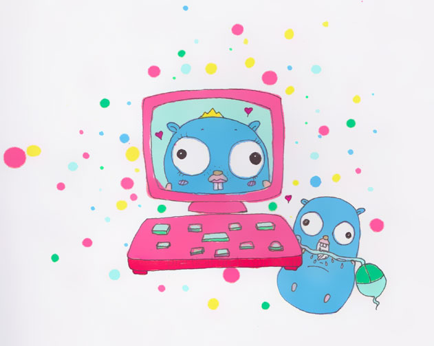

# Chapter 1: Programming A Computer

## 1 What will you learn in this chapter? 

- We will list the different hardware parts of a computer.
- We will see what a program is and how it looks like.
- We will understand how a program is loaded and executed.

## 2 Technical concepts covered 

- Memory Unit, Arithmetic and Logic Unit, Input/Output, Control Unit
- Central memory, Auxiliary memory
- Volatile and non-volatile memory
- RAM/ROM
- CPU
- High and low-level languages
- Assembly language, assembler
- Compiled and interpreted language

## 3 Introduction 

This book is about Go. Before jumping into our main subject, you need to know some basic knowledge about computers.

Experienced programmers can skip this chapter. Beginners should take some time to study it.

Your programs will run on hardware. Knowing how your hardware is working may improve the design of your programs.

Firstly we will describe the main components of a computer. Then we will see what a program is and how the machine handles it.

