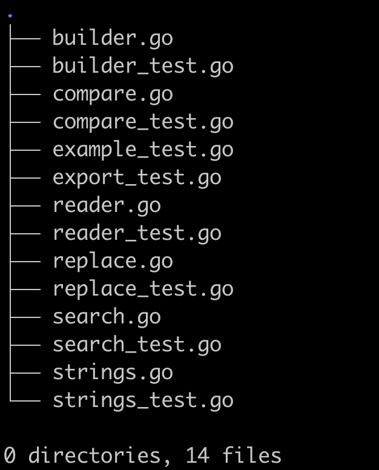
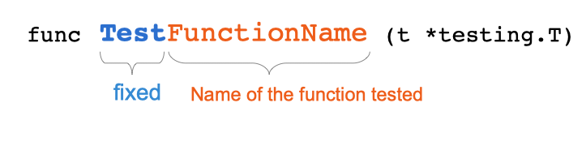
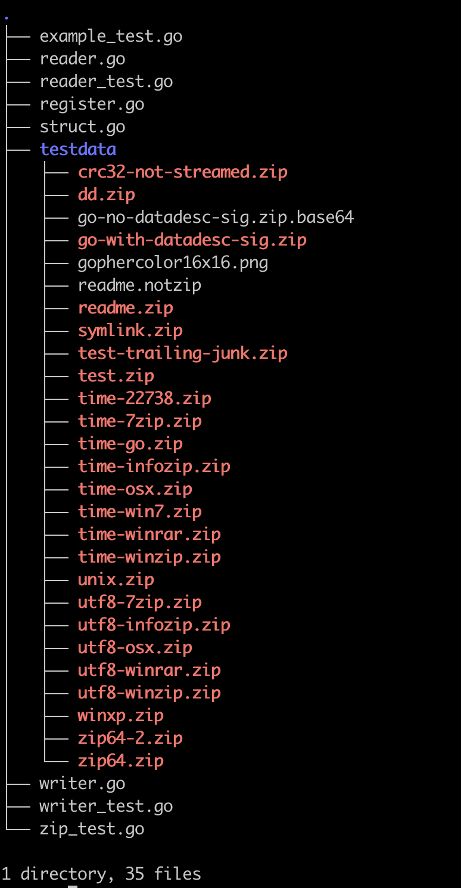

# 第十九章：单元测试

## 1. 本章内容

- 什么是单元测试
- 如何写单元测试
- 怎么在 Go 语言中写单元测试

### 1.1 技术概念

- 单元测试
- 测试用例
- 测试函数
- 断言
- 测试驱动开发（TDD）
- 测试覆盖率


## 2. 引入

这里有一个函数：

```
// 计算旅馆费用
// 货币单位是美元，输入美分
// 使用返回值时记得除以100（如 1031 => 101.32 $）
func totalPrice(nights, rate, cityTax uint) uint {
   return nights*rate + cityTax
}
```

这个函数计算旅馆费用，似乎没什么问题，对吧？那怎么确认它确实没什么问题呢？我们可以试着调用这个函数，看看它的返回结果：

```
package main

import "fmt"

func main() {
   price := totalPrice(3, 10000, 132)
   fmt.Println(price)
}
```

程序的输出是 30132，除以 100，也就是 301.32 美元。

这个结果正确吗？让我们手动计算看看。总费用等于住的天数乘以每天费用加上当地税费：3 x (100 + 1.32) = 3 x 101.32 = 303.96。你发现这个函数的问题了吗？

下面这个语句：

```
return nights*rate + cityTax
```

应该改为：

```
return nights * (rate + cityTax)
```

这样，函数就能返回正确的结果了。

这里不妨让程序自己检查结果是否正确：

```
// unit-test/intro/main.go
package main

import "fmt"

//...

func main() {
    price := totalPrice(3, 10000, 132)
    if price == 30396 {
        fmt.Println("function works")
    } else {
        fmt.Println("function is buggy")
    }
}
```

这个程序将检查函数实现是否正确，毫无疑问，它输出的是 **funtion works**！这个程序就是一个 **单元测试**！


## 3. 什么是单元测试

根据 IEEE（Institute for Electrical and Electronics Engineers 电气与电子工程师协会）的定义，单元测试是“对单个硬件或软件中的某个单元或一组相关单元的测试”。

我们测试的是系统中的某个单独部分，也就是说，判断那个单独部分能否正常工作，而系统作为一个整体并没有被测试。

单元测试由开发者自己完成。通过单元测试，我们可以检查自己写的方法或函数的结果是否符合预期，聚焦于程序中的那些小片段是否正常工作。

有些开发者认为单元测试没什么用，理由是他们在写代码的时候时刻看着系统的运行结果。比如说，web 开发者写一个网页时通常会使用两个屏幕，一个展示源码，一个展示系统。实现新功能时，一边写代码，一边检查代码运行的结果。

不过，这个过程是纯手工的，而且很依赖开发者对系统本身的理解，新员工可能就没法发现里面的错误。那么，如果能够使测试自动化呢？想象一下，你可以在每次构建 Go 程序的时候，甚至每修改一行代码的时候都执行测试，情况会不会不一样呢？


## 4. 什么是测试用例、测试集与断言

单个单元测试叫做测试用例，一组测试用例叫做测试集（或测试套）。

为更好地理解什么是测试用例，我们可以举一个例子。假设你写了一个函数，将字符串中改为大写形式，我们可以写一个测试用例。

这个测试用例由以下几个部分组成：

- 测试输入，比如说："coffee"
- 预期输出，在这个例子中，也就是 "COFFEE"
- 函数的实际输出
- 一种判断实际输出是否与预期输出相同的方法，在这个例子中，我们可以使用 Go 语言中的字符串比较方法，也可以使用一些依赖包的实现，这部分叫做断言


## 5. 为什么要写单元测试

这里，我将引用 IEEE 在一次关于单元测试的调查中总结的理由：

- 单元测试可以确保函数与方法按预期方式工作。如果不做单元测试，开发者就只能在开发过程中手动测试，而这些测试是 **不可重复** 的，开发完成后，也不会再执行这些测试了。
- 将测试整合到源码中，可以在之后运行，避免项目受 **恶劣回归** （nasty regressions 新特性破坏原有功能）的影响。
- 有时是 **客户要求** ，这种情况比较少见，但有些客户的需求规格里会包含测试覆盖率的要求。
- 写单元测试的另一个常见理由是可以 **更聚焦于 API 设计** ，写代码时必须调用自己的代码，因而可以看到代码的一步步演化。在 TDD 场景下，这种聚焦会更明显。
- 单元测试也可以作为某种形式的 **注释文档** ，通过查看单元测试，用户可以立即知道某个函数的具体使用方式。


## 6. 测试文件应该放在哪里

有些编程语言会把所有测试放到一个特定文件夹中，通常是 tests 文件夹。而 Go 的单元测试与被测试代码放在一起，测试作为被测试的包的一部分。

下面是 src/strings 文件夹的文件列表：



> *strings 包的文件夹*

可以看到，每个 xxx.go 文件都有一个对应的 xxx_test.go 文件。

构建程序时，xxx_test.go 文件会被编译器忽略。


## 7. 如何写一个基础的单元测试

让我们一起来写我们的第一个单元测试。测试对象是 `foo` 包：

```
// unit-test/basic/foo/foo.go
package foo

import "fmt"

func Foo() string {
    return fmt.Sprintf("Foo")
}
```


#### 7.0.0.1 测试文件

在 `foo.go` 的同一个文件夹下创建文件 `foo_test.go`：

```
// unit-test/basic/foo/foo_test.go 
package foo

import "testing"

func TestFoo(t *testing.T) {

}
```

可以看到，测试文件是 **foo** 包的组成部分。我们从标准库中引入了 testing 包（后面会用到）。

我们定义了一个函数：TestFoo，参数是一个 testing.T 对象的指针（*testing.T）。


#### 7.0.0.2 测试用例的命名

测试函数的命名遵循以下惯例：



> *测试函数的签名*

- 第一部分是固定的 `"Test"`
- 第二部分通常是被测试函数的函数名，必须以大写字母开头


#### 7.0.0.3 测试用例的内容

示例函数 `Foo` 没有参数，总是返回字符串 `Foo` 。在单元测试中，我们需要检查返回值是不是 `Foo` ：

```
// unit-test/basic/foo/foo_test.go
package foo

import "testing"

func TestFoo(t *testing.T) {
    expected := "Foo"
    actual := Foo()
    if expected != actual {
        t.Errorf("Expected %s do not match actual %s", expected, actual)
    }
}
```

我们定义了变量 `expected` 来保存预期结果，又定义了变量 `actual` 来保存 `foo` 包中 `Foo` 函数的实际返回值。

请记住这两个名字：**actual** 和 **expected** ，它们是测试中的经典变量名。

- **expected** 变量作为用户预期结果
- **actual** 变量保存被测试代码的执行结果

之后是一个断言。我们比较了预期值与实际执行结果，如果它们不相等，就通过 t.Errorf 方法（由 `testing` 包中的 `T` 结构体定义）使测试失败。

```
t.Errorf("Expected %s do not match actual %s", expected, actual)
```


#### 7.0.0.4 关于测试成功的判定

`T` 类型并没有包含表示测试成功的方法。

如果测试函数没有调用表示失败的方法，就说明测试结果为成功。


#### 7.0.0.5 测试失败

可以通过以下方式表示测试失败：

- `Error` : 记录日志并标记该测试函数为失败，测试程序继续执行。
- `Errorf` : 以指定形式记录日志并标记该测试函数为失败，测试程序继续执行。
- `Fail` : 标记该测试函数为失败，测试程序继续执行。
- `FailNow` : 标记测试函数为失败，并结束当前测试函数的执行（不执行失败语句之后的断言）。

另外，也可以使用 `Fatal` 或 `Fatalf` 方法，它们将记录日志并调用 `FailNow` 方法。


#### 7.0.0.6 测试依赖文件

有时，你可能要保存一些测试依赖文件，比如配置文件、CSV文件等。

可以将这些文件保存到 `testdata` 文件夹中。



>  *testdata 文件夹（来自标准库 archive/zip）*


## 8. 断言库

Go 标准库提供了单元测试的所有必要工具。不过，大家也经常使用一些第三方“断言库”，它能提供很多断言函数与方法。其中一个广受欢迎的库是 **github.com/stretchr/testify**。

通过以下命令可以安装这个库：

```
$ go get github.com/stretchr/testify
```

作为例子，下面是用 `github.com/stretchr/testify` 库中的 `assert` 包重写的之前案例中的单元测试：

```
// unit-test/assert-lib/foo/foo_test.go
package foo

import (
    "testing"

    "github.com/stretchr/testify/assert"
)

func TestFoo(t *testing.T) {
    assert.Equal(t, "Foo", Foo(), "they should be equal")
}
```

你也可以在 GitHub 上搜索一些其它库：https://github.com/search?l=Go&q=assertion+library&type=Repositories


## 9. 如何运行单元测试

### 9.1 运行某个包中的测试

必须通过命令行运行单元测试。打开终端，进入项目文件夹：

```
$ cd go/src/gitlab.com/loir402/foo
```

执行以下命令：

```
$ go test
```

结果输出如下：

```
PASS
ok     gitlab.com/loir402/foo 0.005s
```

这个命令会执行当前文件夹中的所有单元测试。例如，如果你想执行 **path** 包的单元测试：

```
$ cd /usr/local/go/src/path
$ go test
```


### 9.2 运行项目中的所有测试

可以通过以下命令执行当前项目中的所有单元测试：

```
$ go test ./...
```


### 9.3 失败的测试

失败测试的输出是什么样的？让我们来看一个案例。修改之前的测试用例，将预期结果改为 `"Bar"` 而不是 `"Foo"` ，使之失败。

```
$ go test
--- FAIL: TestFoo (0.00s)
    foo_test.go:9: Expected Bar do not match actual Foo
FAIL
exit status 1
FAIL   gitlab.com/loir402/foo 0.005s
```

可以看到，失败测试的输出会更具体些。它输出了失败的测试用例的名称（`TestFoo`），也告知具体是在哪一行失败的（`foo_test.go:9`）。

之后是我们指定的错误信息。

程序的退出状态码为 1，如果你使用了持续集成工具，就可以自动检测到测试失败。

#### 9.3.0.1 退出状态码

- 任何不为 0 的状态码表示程序执行错误
- 状态码为 0 表示程序正常退出


### 9.4 go test 与 go vet

执行 `go test` 命令时，Go 也会自动对被测试的包（包括包中的源码与测试文件）执行 `go vet` 命令。

`go vet` 命令是 Go 语言工具链的一部分，负责源码的语法检查，包括许多检查项。不过，在 go test 场景下，只会执行其中一部分检查项：

- atomic

  检查 sync/atomic 包是否被误用

- bool

  检查布尔条件是否被误用

- buildtags

  检查你输入的命令行参数

- nilfunc

  确保你没有将函数与 nil 值进行比较

在执行单元测试前自动执行 `go vet` 命令是个聪明的做法，它能让你提前发现错误，避免对程序造成影响。


### 9.5 仅编译测试

如果只想编译测试，可以执行以下命令：

```
$ go test -c
```

这个命令将创建一个名为 "packageName.test" 的二进制文件。


## 10. 如何写表测试 

前面的示例中，我们只测试了函数的一种可能结果，而在实践中，你可能需要对一个函数写多个测试用例。

其中一种写法是：

```
// unit-test/table-test/price/price_test.go
package price

import "testing"

func Test_totalPrice1(t *testing.T) {
    // 用例 1
    expected := uint(0)
    actual := totalPrice(0, 150, 12)
    if expected != actual {
        t.Errorf("Expected %d does not match actual %d", expected, actual)
    }
    
    // 用例 2
    expected = uint(112)
    actual = totalPrice(1, 100, 12)
    if expected != actual {
        t.Errorf("Expected %d does not match actual %d", expected, actual)
    }

    // 用例 3
    expected = uint(224)
    actual = totalPrice(2, 100, 12)
    if expected != actual {
        t.Errorf("Expected %d does not match actual %d", expected, actual)
    }

}
```

- 我们并列写了三个用例
- 这种写法也能正常运行，不过，使用表测试可能会更加便捷：

```
// unit-test/table-test/price/price_test.go
package price

import "testing"

func Test_totalPrice(t *testing.T) {
    type parameters struct {
        nights  uint
        rate    uint
        cityTax uint
    }
    type testCase struct {
        name string
        args parameters
        want uint
    }
    tests := []testCase{
        {
            name: "test 0 nights",
            args: parameters{nights: 0, rate: 150, cityTax: 12},
            want: 0,
        },
        {
            name: "test 1 nights",
            args: parameters{nights: 1, rate: 100, cityTax: 12},
            want: 112,
        },
        {
            name: "test 2 nights",
            args: parameters{nights: 2, rate: 100, cityTax: 12},
            want: 224,
        },
    }
    for _, tt := range tests {
        t.Run(tt.name, func(t *testing.T) {
            if got := totalPrice(tt.args.nights, tt.args.rate, tt.args.cityTax); got != tt.want {
                t.Errorf("totalPrice() = %v, want %v", got, tt.want)
            }
        })
    }
}
```

- 我们创建了 `parameters` 结构，结构中的每个字段表示函数的一个参数
- 然后，我们创建了 `testCase` 结构，内含三个字段：
  - `name`：测试用例的名称：有意义的、有可读性的字符串
  - `args`：被测试函数所用的参数
  - `want`：函数的预期返回结果
- 之后我们创建了一个 `testCase` 切片，命名为 `tests`，切片中保存的是我们定义好的测试用例
  - 一个测试用例 = 切片中的一个元素
- 在一个 for 循环中迭代处理 `tests` 切片中的元素
- 在每次迭代中调用 `t.Run` 方法：
  - 参数包括：
    - 测试用例的名称：`tt.name`
    - 用于运行测试的匿名函数（签名与标准测试用例接近）
- 在每次迭代中比较函数的实际执行结果与预期结果

下面是测试输出（测试成功场景）：

```
=== RUN   Test_totalPrice
=== RUN   Test_totalPrice/test_0_nights
=== RUN   Test_totalPrice/test_1_nights
=== RUN   Test_totalPrice/test_2_nights
--- PASS: Test_totalPrice (0.00s)
    --- PASS: Test_totalPrice/test_0_nights (0.00s)
    --- PASS: Test_totalPrice/test_1_nights (0.00s)
    --- PASS: Test_totalPrice/test_2_nights (0.00s)
PASS
```

- 输出表明，执行了三次子测试。
- 输出也给出了每次测试的名称和结果。


## 11. Go 语言的两种测试模式

`go test` 命令有两种执行模式：


### 11.1 文件夹模式（Local directory mode）

执行这种测试模式只需要输入以下命令：

```
$ go test
```

这种模式下，Go 会编译当前文件夹下的包。

真正执行的只有当前包层级的单元测试，项目中的其他测试并不会执行。有些 IDE 会在用户保存文件的时候自动执行这种测试模式，也就意味着你每次修改一个文件，都可以看到单元测试能否通过。


### 11.2 包列表模式（Package list mode）

这种模式下，用户可以指定要测试的包，或者测试项目中的所有包。

比如，可以通过下面的命令测试项目中的 `pkgName` 包：

```
go test modulePath/pkgName
```

这个命令将检查项目文件夹，并执行 `modulePath` 下的 `pkgName` 包的测试。


### 11.3 缓存

在 **包列表模式** 下，Go 会保存成功的测试结果，避免测试重复执行。

为看看这种机制，我们可以执行 string 包中的测试：

```
$ go test strings
```

输出结果如下：

```
ok     strings    4.256s
```

可以看到，单元测试执行时间为 4.256 秒，还是挺长的。

重新执行一次：

```
$ go test strings
ok     strings    (cached)
```

可以看到，这次马上就输出结果了，其中可以看到 (cached) 字样，也就是说，Go 输出的是缓存的测试结果。


#### 11.3.0.1 禁用缓存

值得注意的是，当你修改包中源文件后，测试缓存会失效，重新执行的测试是有效测试。

通过以下参数，可以禁用缓存：

```
$ go test strings -count=1
```


#### 11.3.0.2 环境变量与缓存

如果在代码中使用了环境变量，Go 只会在环境变量保持不变的前提下缓存测试结果。

可以看一个例子，假如你在测试代码中使用了 `MYENV` 环境变量：

```
func TestFoo(t *testing.T) {
   env := os.Getenv("MYENV")
   fmt.Println(env)
   //..
}
```

第一次执行测试时，测试会有效执行：

```
$ export MYENV=BAR && go test gitlab.com/loir402/foo
ok     gitlab.com/loir402/foo 0.005s
```

第二次执行时，输出的是缓存结果：

```
ok     gitlab.com/loir402/foo (cached)
```

如果你修改了环境变量 `MYENV`，测试会重新执行：

```
$ export MYENV=CORGE && go test gitlab.com/loir402/foo
ok     gitlab.com/loir402/foo 0.005s
```


#### 11.3.0.3 测试打开的文件

同样的，如果你在测试中打开了某个文件，在文件内容变化时，也会重新执行测试：

```
func TestFoo(t *testing.T) {
   d, err := ioutil.ReadFile("testdata/lol.txt")
   if err != nil {
      t.Errorf("impossible to open file")
   }
   fmt.Print(string(d))
   //..
}
```

这里，我们打开了文件 `testdata/lol.txt`，执行一次测试后，Go 会缓存测试结果。

如果我们修改 testate/lol.txt 文件的内容，重新执行测试命令，Go 会重新执行测试，因为文件内容改变了，即测试条件已经不同了。


## 12 并行执行单元测试

在大型项目中，单元测试的数量可能会非常多，运行单元测试需要很多时间。

此时，你需要在测试中调用 `Parallel` 方法，从而并行执行这些测试。

可以举一个例子：

```
func TestCorge1(t *testing.T) {
   time.Sleep(300 * time.Millisecond)
}

func TestCorge2(t *testing.T) {
   time.Sleep(300 * time.Millisecond)
}

func TestCorge3(t *testing.T) {
   time.Sleep(300 * time.Millisecond)
}
```

我们写了三个单元测试，每个测试只是单纯地等待 300 毫秒，没有添加任何断言，这样理解起来更容易一点。

执行这些测试：

```
$ go test
```

输出结果如下：

```
PASS
ok     gitlab.com/loir402/corge   0.913s
```

测试用时为 0.913 秒，与 3 * 300ms 接近。

接下来，我们在测试中加入支持并行的代码：

```
func TestCorge1(t *testing.T) {
   t.Parallel()
   time.Sleep(300 * time.Millisecond)
}

func TestCorge2(t *testing.T) {
   t.Parallel()
   time.Sleep(300 * time.Millisecond)
}

func TestCorge3(t *testing.T) {
   t.Parallel()
   time.Sleep(300 * time.Millisecond)
}
```

我们只是在测试函数开头增加了下面这行代码：

```
t.Parallel()
```

这行代码大幅减少了测试用时：

```
$ go test
PASS
ok     gitlab.com/loir402/corge   0.308s
```

测试用时减少了三分之二！对开发团队来说，这种用时节约是非常珍贵的。因此，记得在单元测试中利用好这个特性。


## 13 测试命令进阶

### 13.1 通过命令行传递参数（-args）

可以通过命令行传递测试参数。我们来看一个例子：

```
func TestArgs(t *testing.T) {
    arg1 := os.Args[1]
    if arg1 != "baz" {
        t.Errorf("Expected baz do not match actual %s", arg1)
    }
}
```

这里，我们使用了命令行传递的第二个参数。`os.Args` 是一个字符串切片（`[]string`），切片的第一个元素（索引 0）由 go test 命令内部使用（构建缓存结果的地址）。

为传递参数，可以使用 **-args** 标记：

```
$ go test gitlab.com/loir402/foo -args bar
```

测试执行结果如下：

```
--- FAIL: TestArgs (0.00s)
    foo_test.go:24: Expected baz do not match actual bar
FAIL
FAIL    gitlab.com/loir402/foo  0.005s
```

通过这种方式，可以传递任意数量的参数。注意，`-args` 的内容不能缓存。


### 13.2 命令行标记（flags）

go test 命令支持所有构建命令标记，同时也支持一些特殊标记。本章中我们有意忽略了基准测试相关标记，这部分内容之后会有单独一章专门讨论。


#### 13.2.0.1 覆盖率标记

这个标记会展示覆盖率分析数据。我认为这是你应该知道的最重要的一个标记，覆盖率数据会统计单元测试所覆盖的代码语句的比例：

```
$ go test -cover
PASS
coverage: 100.0% of statements
ok      gitlab.com/loir402/foo  0.005s
```

用户可以选择不同的覆盖率计算方式（默认方式为 "set"，你也可以选择 "count" 或 "atomic"），相关信息见本文后面的章节。


#### 13.2.0.2 测试执行相关标记

使用这个标记（译者注：-failfast）后，某个测试失败时，之后的测试不再执行。这个标记在 debug 时很有用。

这个标记（译者注：-parallel）定义了可以并行执行的测试数量，默认值为 GOMAXPROCS。

默认情况下，测试执行的超时时间为 10 分钟。因此，如果单元测试的运行时间超过 10 分钟，程序就会报错。需要时，你可以指定测试超时时间（译者注：-timeout）（这个标记的值是一个字符串，但会被解析为 time.Duration 类型）。

详细输出模式下（译者注：-v），程序将输出正在测试的函数名。下面是一个详细输出的例子：

```
=== RUN   TestCorge1
=== PAUSE TestCorge1
=== RUN   TestCorge2
=== PAUSE TestCorge2
=== RUN   TestCorge3
=== PAUSE TestCorge3
=== CONT  TestCorge1
=== CONT  TestCorge3
=== CONT  TestCorge2
--- PASS: TestCorge2 (0.31s)
--- PASS: TestCorge3 (0.31s)
--- PASS: TestCorge1 (0.31s)
PASS
ok      gitlab.com/loir402/corge    0.311s
```

因为使用了并行模式，输出结果多了很多。在非并行模式下，输出结果不会体现 PAUSE 和 CONT 步骤：

```
=== RUN   TestCorge1
--- PASS: TestCorge1 (0.31s)
=== RUN   TestCorge2
--- PASS: TestCorge2 (0.31s)
=== RUN   TestCorge3
--- PASS: TestCorge3 (0.31s)
PASS
ok      gitlab.com/loir402/corge    0.921s
```

执行测试时会自动执行 go vet，如果你想禁用这个默认行为（个人不推荐），可以设置这个标记（译者注：-vet）为 off。其它编译检查项依然有效。


#### 13.2.0.3 性能相关标记

go test 命令也支持一些性能测试相关标记，我们会在性能章节专门讨论。


## 14. 测试覆盖率

- 如何判断一个项目是否被充分测试？
- 如何定义好的测试级别？
- 如何衡量一个项目的测试级别？

测试覆盖率就是回答这些问题的。覆盖率衡量一个项目被测试的程度，结果通常为一个百分数。

覆盖率衡量方式并不是唯一的。go 提供了三种覆盖率统计方式。

使用下面的命令，可以查看你的代码的测试覆盖率：

```
$ go test -cover
PASS
coverage: 66.7% of statements

ok      go_book/testCoverage    0.005s
```

可以看到，测试输出多了一行，给出了测试覆盖率。

下面，我们来看看覆盖率的不同计算方式。


### 14.1 set 模式

这是默认模式，从字面意义看，这个模式也可以称为“语句覆盖率”模式，它统计的是测试中执行的语句占比。

覆盖率最高值是 100%，也就是所有语句都在测试过程中执行到了。

以下面的代码为例：

```
package testCoverage

func BazBaz(number int) int {
    if number < 10 {
        return number
    } else {
        return number
    }
}
```

这个包定义了一个函数，函数中包括两个条件分支，分支条件分别为输入值小于或大于 10。

让我们写一个测试：

```
func TestBazBaz(t *testing.T) {
    expected := 3
    actual := BazBaz(3)
    if actual != expected {
        t.Errorf("actual %d, expected %d", actual, expected)
    }
}
```

在这个测试中，我们以参数 3 执行 `BazBaz` 函数。

测试输出如下：

```
go test -cover
PASS
coverage: 66.7% of statements

ok      go_book/testCoverage    0.005s
```

只有 66.7% 的语句覆盖率。


#### 14.1.0.1 覆盖率文件

go 可以生成一个覆盖率文件，详细说明测试所覆盖语句。

![Coverprofile HTML generated[fig:Coverprofile-HTML-generated]](imgs/coverprofile.7c88947f.png)

> *生成的覆盖率 HTML 文件*

通过两个命令，可以生成上面这个覆盖率文件。

```
$ go test -coverprofile profile
```

第一个命令生成如下文件：

```
mode: set
unit-test/coverage/testCoverage.go:3.29,4.17 1 1
unit-test/coverage/testCoverage.go:4.17,6.3 1 1
unit-test/coverage/testCoverage.go:6.8,8.3 1 0
```

文件具体说明了你的每块代码是否被测试覆盖。每行信息代表一个代码块，行尾两个数字即代码块中的语句总数与被覆盖的语句数。

![Coverprofile file[fig:Coverprofile-file]](imgs/coverprofile_schema.c82c76f2.png)

> *覆盖率文件*

这个文件可读性不是很好。不过，通过它可以生成上面的 HTML 文件。为此，你可以执行第二条命令：

```
$ go tool cover -html=profile
```

这个命令创建一个 HTML 页面（并不会保存在你的项目文件夹下）并在浏览器中打开。


#### 14.1.0.2 提升覆盖率

在上面的例子中，我们有 3 条语句，测试覆盖了两条：即第一条 if 语句与第一个返回语句，因此语句覆盖率为 2/3 （或 66.7%）。

增加一个覆盖 else 语句的测试，可以将覆盖率提高到 100%：

```
func TestBazBaz2(t *testing.T) {
    expected := 25
    actual := BazBaz(25)
    if actual != expected {
        t.Errorf("actual %d, expected %d", actual, expected)
    }
}
```

这样，所有语句都被测试了，测试覆盖率达到 100%。


### 14.2 count 模式

**count** 模式与 **set** 模式类似，此模式可以检查代码中的某部分被几个用例所测试。

例如，下面这个函数：

```
func BazBaz(number int) int {
    if number < 10 {
        return number
    } else {
        return number
    }
}
```

被两个测试用例所测试：

- 其中一个输入小于 10
- 另一个输入大于 10

所有语句都被覆盖了，而其中第一条语句（if 条件语句）被测试了两次。在第二个用例中，这个语句依然被执行了。

count 模式的 HTML 文件和之前的有点不同：

![Coverprofile Count mode[fig:Coverprofile-Count-mode]](imgs/coverprofile_count.42abb5d1.png)

> *Count 模式的覆盖率文件*

语句颜色越绿，被测试次数越多。

下面的测试覆盖率文件与之前的类似：

```
mode: count
unit-test/coverage/testCoverage.go:3.29,4.17 1 2
unit-test/coverage/testCoverage.go:4.17,6.3 1 1
unit-test/coverage/testCoverage.go:6.8,8.3 1 1
```

在第二行可以看到，第一个代码块（开始位置为 3.29，结束位置为 4.17）有 1 条语句，被测试了 2 次。


### 14.3 atomic 模式（进阶内容）

最后一个是 atomic 模式，在测试并发程序时比较有用。系统会通过原子计数器（而不是简单计数器）来统计覆盖率，这些计数器是并发安全的，因此统计结果要更为精确。

作为例子，我们修改了 `BazBaz` 函数，给它加上一些毫无意义的协程：

```
// unit-test/coverage/testCoverage.go
package testCoverage

import (
    "fmt"
    "sync"
)

func BazBaz(number int) int {
    var waitGroup sync.WaitGroup
    for i := 0; i < 100; i++ {
        waitGroup.Add(1)
        go concurrentTask(number, &waitGroup)
    }
    waitGroup.Wait()
    return number
}

func concurrentTask(number int, waitGroup *sync.WaitGroup) {
    useless := number + 2
    fmt.Println(useless)
    waitGroup.Done()
}
```

We will launch 100 useless concurrent tasks that just make an assignment: set useless to the number + 2. We use waitgroups to ensure that all our concurrent tasks will execute before the program ends. We do not modify the unit tests.

Let’s get the coverprofile in count mode :

这里，我们增加了 100 个协程任务：对 number 的值加 2。通过 waitgroup，可以确保程序在这些协程任务完成之后才会退出。单元测试代码不做修改。

count 模式下，测试输出如下：

```
$ go test -coverprofile profileCount -covermode count
$ cat profileCount
mode: count
go_book/testCoverage/testCoverage.go:8.29,10.27 2 2
go_book/testCoverage/testCoverage.go:14.2,15.15 2 2
go_book/testCoverage/testCoverage.go:10.27,13.3 2 200
go_book/testCoverage/testCoverage.go:18.60,22.2 3 197
```

atomic 模式下，输入如下：

```
$ go test -coverprofile profileAtomic -covermode atomic
$ cat profileAtomic
mode: atomic
go_book/testCoverage/testCoverage.go:8.29,10.27 2 2
go_book/testCoverage/testCoverage.go:14.2,15.15 2 2
go_book/testCoverage/testCoverage.go:10.27,13.3 2 200
go_book/testCoverage/testCoverage.go:18.60,22.2 3 200
```

可以看到，count 模式下的统计并不准确。最后一个代码块（18.60 到 22.2）在 count 模式下的统计结果是 197 次，而正确的值是 atomic 模式下统计的 200 次。

在创建覆盖率文件时经常会使用这种模式。


## 15. 测试驱动开发（TDD）

测试驱动开发（TDD）是一种在写代码前先设计好测试用例的开发方式。

上世纪九十年代末，这种开发方式随极限编程一起出现，随后在社区不断发展，技术作者如 Robert C. Martin 等对此多有贡献。

我们还是直接来看 Go 中的例子。假如我们要添加一个函数，统计字符串中的元音字母数。首先，我们可以写一个测试用例（这个用例一定会失败，因为我们还没开始写函数呢）：

```
// unit-test/tdd/tdd_test.go
package tdd

import "testing"

func TestVowelCount(t *testing.T) {
    expected := uint(5)
    actual := VowelCount("I love you")
    if actual != expected {
        t.Errorf("actual %d, expected %d", actual, expected)
    }
}
```

用例中，我们用参数 `"I love you"` 调用函数 `VowelCount`，字符串中有 5 个元音，预期结果是整型值 5，然后比较实际结果和预期结果。

让我们运行测试看看：

```
$ go test
# go_book/tdd [go_book/tdd.test]
./tdd_test.go:7:12: undefined: VowelCount
FAIL    go_book/tdd [build failed]
```

无法编译，测试失败。

现在，我们来实现这个函数。先创建一个元音映射表。

```
// unit-test/tdd/tdd.go
package tdd

var vowels = map[string]bool{
    "a": true,
    "e": true,
    "i": true,
    "o": true,
    "u": true}
```

然后创建函数，检查字符串中的每个字符，看看是否在映射表中：

```
// unit-test/tdd/tdd.go
package tdd

//...

func VowelCount(sentence string) uint {
    var count uint
    for _, char := range sentence {
        if vowels[string(char)] {
            count++
        }
    }
    return count
}
```

由于字符是 Unicode 值，我们在代码中将它转为字符串。再次运行测试：

```
$ go test
--- FAIL: TestVowelCount (0.00s)
    tdd_test.go:9: actual 4, expected 5
FAIL
exit status 1

FAIL    go_book/tdd     0.005s
```

失败了。错在哪里呢？看样子好像漏了一个字母。输入中的 I 是大写字母，而映射表中只有小写字母，这是一个 bug，大写字母应该也要统计。

现在，我们有两个选择：

1. 在映射表中添加大写字母。
2. 在比较时将所有字母转换为小写字母。

第二个选项的效率似乎比第一个选项更低：

- 在第二个选项中，必须花时间转换每个字母，
- 而在第一个选项中，只需要查找映射表即可，而查找映射表是很快的（O(1) 时间效率）。

让我们在映射表中添加大写元音字母：

```
var vowels = map[string]bool{
    //...
    "A": true,
    "E": true,
    "I": true,
    "O": true,
    "U": true}
```

再次运行测试，可以看到测试成功。

```
$ go test
PASS

ok      go_book/tdd     0.005s
```


#### 15.0.0.1 TDD 的优势

- 开发者必须让自己写的函数 **可测试**。
- 在写测试时就确定了函数签名，这是一种聚焦于函数功能的设计行为，某种意义上说，我们是在 **用户视角** 来设计 API。在实现 API 前先使用它迫使我们保持 API 简单可用。
- 在 TDD 下，**每个函数都会被测试**。

你可能会说，这种开发方式不太自然。这种感觉是正常的，我遇到的很多开发者（特别是新手）都不愿写测试，只希望在最短时间内完成功能开发。


#### 15.0.0.2 一些相关事实

为了说服你采用这种开发方式，这里提供一些关于 TDD 的研究结论（这些结论在 2005 年已经由 David Janzen 在一篇优秀文章中说明过了）：

- 对一个有 9 个开发者的团队，TDD 减少了 50% 的缺陷率，而对生产率只有极小的影响。
- 对另一个也是 9 个人的团队，缺陷率减少了 40%，对生产率完全没有影响。
- 单元测试改善了团队中的信息流。
- 一个计算机专业本科生课堂上的研究显示，TDD 使每千行代码的缺陷率减少了 45%。

希望这些事实能使你信服。


## 16. 本章自测

### 16.1 问题

1. 在 Go 中，测试文件一般保持在哪里？
2. 按惯例， `ShippingCose` 函数的测试函数应该如何命名？
3. 如果在测试时需要加载一个单独的文件，你会将这个文件保存在哪里？
4. 什么是断言？可以举一个例子吗？


### 16.2 参考答案

1. 在 Go 中，测试文件一般保存在哪里？

   1. 保存在被测试代码所在的同一个文件夹中。

2. 按惯例， `ShippingCose` 函数的测试函数应该如何命名？

   ```
   func TestShippingCost(t *testing.T)
   ```

   1. 注意函数开头的 `Test` 字符串，这是强制的。
   2. "Test" 之后的内容可以随意，但必须以大写字母或下划线（_）开头。

3. 如果在测试时需要加载一个单独的文件，你会将这个文件保存在哪里？

   1. 可以在被测试代码所在文件夹下创建一个 "testdata" 文件夹。
   2. 将测试执行中用到的文件放入这个文件夹。

4. 什么是断言？可以举一个例子吗？

   1. 单元测试中，断言是一个布尔表达式（即值为 true 或 false 的表达式）。
   2. 一个“传统”例子是：

   ```
   actual == expected
   ```


## 17. 本章总结

- 写单元测试是个好习惯：

  - 避免代码持续劣化
  - 在投入生产环境前暴露 bug
  - 改善 API 设计

- 单元测试与源代码在一起

- 测试写在测试文件中

- 按惯例，测试文件命名为 **xxx_test.go**

- 一个测试文件可以包含多个测试函数

- 一个测试函数可以包含多个测试用例

- 测试函数命名必须以 `Test` 开头，随后紧接一个大写字母或下划线

- 测试函数命名中一般包含被测试函数的名称

- 测试函数有如下签名：

  ```
  func TestShippingCost(t *testing.T)
  ```

- 通过表测试，可以方便地在一个函数中测试多个用例

- 测试驱动开发是一种提供代码质量，减少代码缺陷的开发方法：

  - 在函数实现前写好单元测试
  - 单元测试会失败，而我们的目标就是让它通过


## 参考文献：

- [institute1990ieee] Electrical, Institute of, and Electronics Engineers. 1990. “IEEE Standard Glossary of Software Engineering Terminology: Approved September 28, 1990, IEEE Standards Board.” In. Inst. of Electrical; Electronics Engineers.
- [runeson2006survey] Runeson, Per. 2006. “A Survey of Unit Testing Practices.” IEEE Software 23 (4): 22–29.
- [zhu1997software] Zhu, Hong, Patrick AV Hall, and John HR May. 1997. “Software Unit Test Coverage and Adequacy.” Acm Computing Surveys (Csur) 29 (4): 366–427.
- [janzen2005test] Janzen, David, and Hossein Saiedian. 2005. “Test-Driven Development Concepts, Taxonomy, and Future Direction.” Computer 38 (9): 43–50.
- [maximilien2003assessing] Maximilien, E Michael, and Laurie Williams. 2003. “Assessing Test-Driven Development at IBM.” In Software Engineering, 2003. Proceedings. 25th International Conference on, 564–69. IEEE.
- [williams2003test] Williams, Laurie, E Michael Maximilien, and Mladen Vouk. 2003. “Test-Driven Development as a Defect-Reduction Practice.” In Software Reliability Engineering, 2003. ISSRE 2003. 14th International Symposium on, 34–45. IEEE.
- [kaufmann2003implications] Kaufmann, Reid, and David Janzen. 2003. “Implications of Test-Driven Development: A Pilot Study.” In Companion of the 18th Annual ACM SIGPLAN Conference on Object-Oriented Programming, Systems, Languages, and Applications, 298–99. ACM.
- [edwards2003using] Edwards, Stephen H. 2003. “Using Test-Driven Development in the Classroom: Providing Students with Automatic, Concrete Feedback on Performance.” In Proceedings of the International Conference on Education and Information Systems: Technologies and Applications EISTA. Vol. 3. Citeseer.