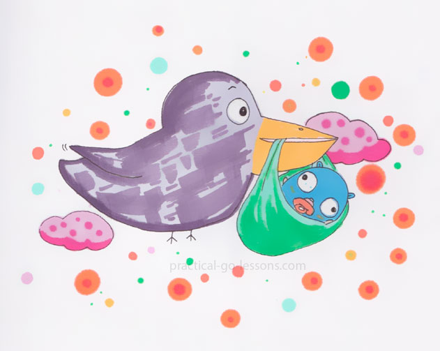

# Chapter 2: Go 语言

## 1 本章中能学到的内容

- Go 的起源：它是什么时候被谁创造的。
- 创造 Go 语言背后的动机。
- Go 语言主要的特征是什么。

## 2 本章中提及的技术概念

- 构建时间
- 静态类型语言
- 并发
- 垃圾收集器
- 软件依赖

## 3 创世神话

关于 Go 语言的创建有一个神话。它诞生于 Google 的办公室内，它发生在耗时 45 分钟的漫长构建过程中。

这个故事由 Rob Pike 在 [[@go-at-google]](#go-at-google) 中讲述。它为我们提供了关于创建 Go 背后动机的宝贵信息。构建时间太长太痛苦……他们不得不想办法避免它们；那是 Go 创世纪的切入点。

Robert Griesemer、Ken Thompson 和 Rob Pike 是 2007 年开始研究 Go 的开发人员。 Rob Pike 声称，到 2008 年年中，该语言 "很多部分已经被设计出来了，并且实现（编译器、运行时）开始工作了。"。之后，Ian Lance Taylor 和 Russ Cox 于 2008 年加入团队 [[@pike2009go]](#pike2009go)。

Go 是一种开源编程语言，由其社区和在 Google 工作的核心开发人员团队维护。 Go 首次发布是在 2011 年 3 月 16 日 。 （它被命名为“r56”）。 Go 版本 1 于 2012 年 3 月 28 日发布。

## 4 动机

Go（或 Golang）是由 Google 构建的，用于解决企业级问题。为了更好的理解原因，值得阅读 Rob Pike [[@go-at-google]](#go-at-google) 的主题演讲。

大型跨国公司的软件面临哪些挑战？（以谷歌为例）
- Google 服务的代码库非常庞大。谷歌有数百万行代码。
- 这些代码是用不同的语言编写的：C、C++、Java 等。
- 这些应用程序的**构建时间**“已经延长到几分钟，甚至几小时”
- 更新某些应用程序部件的代价可能非常高昂。

第一个  Gophers[1](#1) 的目标是通过以下方式使开发人员的生活更轻松：
- 大幅减少程序的构建时间。
- 为接触过 C、C++ 或 Java 的年轻开发人员设计一种易于学习、阅读和调试的语言。
- 设计一个有效的**依赖**管理系统。
- 构建一种可以在硬件上生成可很好扩展的软件的语言。 

### 4.1 一些概念的定义

- **构建时间**：编译器生成机器可读的可执行文件所需的时间。
- **静态类型语言**：现在给出这个概念的精确定义还为时过早。 我们将在接下来的章节中介绍这个术语。
- **依赖**：一个软件被另一个软件使用。
- **可扩展性**：程序处理越来越多的待执行任务的能力。 例如，如果一个网站可以接受越来越多的请求而不会停机或增加加载延迟，那么它就被认为是可扩展的。 

## 5 Go 主要功能

Go 的创造者将他们的精力集中在几个关键的设计选择上：
- 一种编译型语言
- 语法易于理解和学习
- **静态类型**
- 具有内置**并发性**的系统，易于开发人员工作
- 具有强大的依赖管理功能
- 拥有自动的**垃圾收集器**
  
正如 Rob Pike 所说，Go 的主要目标是为开发人员提供一种易于学习的语言，用于“设计大型软件项目” 。

### 5.1 一些概念

- **并发**：当任务可以无序或部分顺序执行时，就说程序是 并发的 [2](#2)。
- **垃圾收集器**（通常我们叫做 GC）：当我们构建程序的时候，我们需要在内存中存储和读取数据。内存不是无限的资源。因此开发者必须确保不时销毁存储在内存中的未使用的元素。将数据存入内存我们称为分配；相反的操作，包括从内存中删除数据我们称之为释放。垃圾收集器的作用就是在某一元素不再被使用时释放其所占用的内存。如果某一语言不具有任何垃圾收集器，开发人员必须手动收集他的垃圾并释放不再使用的内存......碰巧，Go 有一个垃圾收集器。

## 6 Go 目前状态

- 该项目发展非常迅速，现在已经有超过一千名贡献者 [3](#3)。
- 在撰写本文时（2020 年 1 月 8 日），Go 的最新版本是 1.15.6 。
- 目前已经组织了许多聚会和会议来联合社区[4](#4)
    - 2018 年共组织了 19 个会议：3 个在美国，16 个在其他国家5 [5](#5)
    - 2017年共举办13场会议 
- Go 在开发者当中也很受欢迎：
    - 在 2018、2019 和 2020 年的 Stackoverflow 开发人员调查中，Go 是最受欢迎的三种编程语言之一 [@dev-survy-2018]。 

## 7 自我测试

### 问题

1. Go 语言的诞生日期是什么时候？
2. 什么是并发？
3. 平均而言，Go 的构建时间很长，正确还是错误？

### 答案

1. Go 语言的诞生日期是什么时候？
   1. 2007
2. 什么是并发？
   1. 当任务可能同时执行时，程序是并发的。
3. 平均而言，Go 的构建时间很长，正确还是错误？
   1. 错误。创建该语言就是为了解决这个确切的问题。

## 8 要点

- Go 诞生于 2007 年。
- Go 第一个版本发布于 2012 年。
- Go 语言很容易理解。并且它的语法很简单。
- Go 是静态类型语言。
- Go 是编译型语言。
- 你可以用 Go 编写并发程序。

---

1. 这是 Go 程序员的昵称[↩](#4.1)
2. 我们将在另一章中更深入地探讨这个概念。定义取自 https://en.wikipedia.org/wiki/Concurrency_(computer_science)︎ [↩](#5.1)
3. 2019 年 8 月 13 日，Go 项目有 1,349 名贡献者[↩](#6.1)
4. 请参阅此页面 https://github.com/golang/go/wiki/Conferences[↩](#6.2)
5. 这些数字是从网页 https://github.com/golang/go/wiki/Conferences 中提取的，于 2019 年 8 月 13 日检查[↩︎](#6.3)

## 9 参考文献

- [go-at-google] ———. 2012. “Go at Google: Language Design in the Service of Software Engineering.” https://talks.golang.org/2012/splash.article.
- [pike2009go] Pike, Rob. 2009. “The Go Programming Language.” Talk Given at Google’s Tech Talks.
- [dev-survy-2018] “Stackoverflow Developer Survey 2018.” 2018. https://insights.stackoverflow.com/survey/2018/.