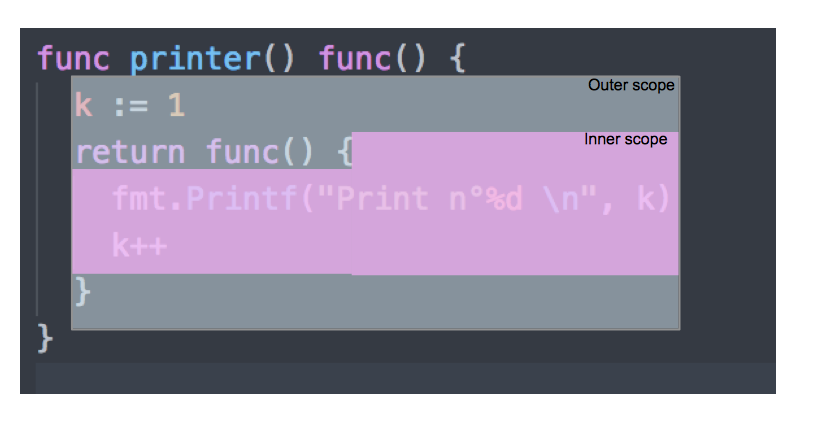

# 第 24 章: 匿名函数和闭包


## 1 你将在本章中学到什么? 

- 什么是匿名函数？

- 如何创建匿名函数。

- 如何调用匿名函数。

- 什么是闭包？

- 什么是函数类型？

## 2 提及的重要概念 

- 匿名函数

- 函数表达式

- 上下文

- 作用域

## 3 匿名函数 

匿名函数与普通函数类似，只是匿名函数没有被显式命名

要创建匿名函数，我们需要使用 func 关键字：

```go
// anonymous/anon/main.go
package main

import "fmt"

func main() {
    // 创建一个匿名函数
    func() {
        // 匿名函数体
        fmt.Println("I am anonymous function")
    }()
}
```

这里我们通过语法 `func(){..}` 定义了一个没有名字的函数，并且通过 `()` 执行该函数

因此，要定义一个匿名函数并立即执行，可以通过以下语法：

```go
func(){...}()
```

- 定义匿名函数： `func(){..}`

- 定义并立即执行： `func(){..}()`

让我们再举一个例子

```go
// anonymous/example-2/main.go
package main

import (
    "fmt"
    "reflect"
)

func main() {

    /**
     * 没有立即执行的匿名函数
     */
    myFunc := func() int {
        fmt.Println("I am a func litteral")
        return 42
    }
    // 输出 : 什么也没有输出～
    // 该匿名函数没有被执行

    fmt.Println(reflect.TypeOf(myFunc))
    // 输出 : func() int

    /**
     * 立即执行的匿名函数
     */
    funcValue := func() int {
        fmt.Println("I am a func literal invoked")
        return 42

    }()
    // 输出 : I am a func literal invoked
    // 该匿名函数被执行
    fmt.Println(reflect.TypeOf(funcValue))
    // 输出 : int

}
```

重点概括：

- 函数可以没有名称；

- 我们可以将函数本身存储到变量中（不同于以往变量中存储值，这点比较麻烦）。

## 4 函数类型

我们可以通过函数签名定义类型。这是从 gin 模块 (https://github.com/gin-gonic/gin) 中获取的示例：

```go
package gin

//...

type HandlerFunc func(*Context)

//...
```

这是从标准库 http 包中获取的示例：

```go
package http
// ...
type HandlerFunc func(ResponseWriter, *Request)

//...
```

函数类型定义了函数的参数和返回值，当你定义一个函数变量，就可以创建一个该函数类型的变量。举个例子：

```go
type Funky func(string)

var f Funky
f = func(s string){
    // my function defined
    log.Printf("Funky %s",s)
}
f("Groovy")
```

- 我们定义了一个新的类型 `Funky` 。
`Funky`类型表示参数为字符串且没有返回值的所有函数。`(func(string))`

- 我们创建一个 `Funky` 类型的变量 `f` 。

- 然后我们为变量 `f` 赋值一个匿名函数。

- 最后，我们执行 `f("Groovy")` 。

## 5 函数是 “一等公民”

在一些编程语言中，函数作为 “一等公民”， 允许他们：

- 作为参数

- 作为返回值

- 赋值给变量

Go语言中函数被认为是 “一等公民”， 这意味着：

- 函数可以作为参数传递给其他函数

- 函数可以作为返回值

- 函数可以赋值给变量 

## 6 闭包

定义到一个函数中的匿名函数，可以使用该函数作用域下的变量，即使该变量没有在匿名函数作用域下。

匿名函数可以保留对上下文的引用，当函数引用未在其作用域内的变量时，就会形成闭包。

### 6.1 示例

这是一个闭包的例子：

```go
// anonymous/first-closure/main.go
package main

import "fmt"

func printer() func() {
    k := 1
    return func() {
        fmt.Printf("Print n. %d\n", k)
        k++
    }
}

func main() {

    p := printer()
    p()
    // Print n. 1
    p()
    // Print n. 2
    p()
    // Print n. 3
}
```

我们有一个 `printer` 函数，该方法的签名是 `printer() func()`, 这个签名意味着这个函数将返回一个函数，
被返回的这个函数没有返回值。

我们可以使用签名 `func() int` 做为返回值，这意味着我们返回的函数将会返回一个整数。

让我们进入函数声明。首先，定义了一个初始化值为 1 的变量。然后返回一个匿名函数，该匿名函数
输出 `"Print n. %d\n"`, `%d` 的值为 `k` 。

- k为外部函数中定义的变量。

- 我们返回的新的匿名函数中，使用了外部变量k。

因此我们创建了一个闭包。

- 在 `main` 函数中，我们将 `printer` 函数的返回值（一个函数）赋值给 `p` 。

- `p` 是一个函数，我们只需在末尾添加括号即可执行这个被返回的函数：

```go
p() // 执行 p 这个闭包
```

`p` 的类型是 `func()` 。

### 6.2 作用域

- 我们说这个匿名函数获取了他的上下文的变量。

- 该函数保存了它当前运行环境的变量。


- 函数（或变量）的作用域是一个区域，我们可以在同一作用域内使用所有声明在该作用域内的变量（类型、常量）。

- 封闭函数定义了一个外部作用域。在我们的例子中，我们在 `printer` 函数的外部作用域定义变量 `k`, 然后在
返回的函数作用域（内部作用域）中使用 `k` 。

- 我们在内部作用域使用了一个外部作用域声明的变量。

- 闭包存储了我们在外部作用域声明的变量的引用。

- 所以我们在多次执行闭包时，变量 `k` 的值会增加。因为闭包持有引用，每次执行，都会修改底层的值。

## 7 闭包的一些常见用例

### 7.1 函数参数

您可以将一个函数作为另一个函数的参数传递。在 `sort` 包（标准库的一部分）中，有几个函数接收函数作为参数的例子：

```go
// sort package

// 使用二进制搜索特定值的索引
func Search(n int, f func(int) bool) int

// 根据传入的函数参数 less 对切片进行排序
func Slice(slice interface{}, less func(i, j int) bool)
```

在前边两个函数签名中，我们看到 `sort.Search` 和 `sort.Slice` 函数需要传入函数参数。该函数在内部用于执行排序工作。

让我们举个例子：

```go
// anonymous/input-parameters/main.go
package main

import (
    "fmt"
    "sort"
)

func main() {
    scores := []int{10, 89, 76, 3, 20, 12}
    // 升序排序
    sort.Slice(scores, func(i, j int) bool { return scores[i] < scores[j] })
    fmt.Println(scores)
    // 输出 : [3 10 12 20 76 89]

    // 降序排序
    sort.Slice(scores, func(i, j int) bool { return scores[i] > scores[j] })
    fmt.Println(scores)
    // 输出 : [89 76 20 12 10 3]
}
```

- 我们定义了一个整数切片 `scores`， 它代表了 6 场 “地鼠” 游戏（一种只有地鼠才会进行的运动）的获胜分数。

- `scores` 切片并没有进行排序，我们的目标是将 `scores` 按顺序进行排序。

- 我们使用函数 `sort.Slice` 。

- 它的函数签名需要传入一个切片和一个函数。 这个函数将决定按什么规则对切片进行排序。需要传入的函数需要两个整形参数，表示两个索引，且返回一个布尔值。

- 这里有一个闭包。传入的函数使用了没有声明在其作用域内的变量 `scores` 。

在第一个例子中，`less` 函数是：

```go
func(i, j int) bool { return scores[i] < scores[j] }
```

如果下标 `i` 对应的值小于 `j` 对应的值，那么会将下标 `i` 对应的值排到 `j` 之前。

因此切片按升序排序：

```go
[3 10 12 20 76 89]
```

在第二个例子中，`less` 函数是：

```go
func(i, j int) bool { return scores[i] > scores[j] }
```

如果下标 `i` 对应的值大于 `j` 对应的值，那么会将下标 `i` 对应的值排到 `j` 之前。

因此是降序排序:

```go
[89 76 20 12 10 3]
```

### 7.2 封装： `http.HandleFunc`

我们可以使用闭包来封装其他函数

在解释技术之前，我们先来构建一个简单的 `Web` 服务器（如果您已经知道如何去做，可以跳过这一段）

#### 7.2.1 网络服务器的基本设置

在下边代码块中，我们指定如果将请求发送到访问端点 `"/homepage"` 时将执行函数 `homepageHandler` 。

```go
// anonymous/wrappers/main.go 

func homepageHandler(writer http.ResponseWriter, request *http.Request) {
  fmt.Fprintln(writer, "Welcome to my homepage")
  fmt.Fprintln(writer, "I am max")
}
```

`homepageHandler` 函数使用了 `http.ResponseWriter` 和 `http.Request` 。

这是一个非常简单的 `Web` 服务器示例：

```go
// anonymous/wrappers/main.go 

package main

import (
    "fmt"
    "net/http"
)

func main() {
    http.HandleFunc("/homepage", homepageHandler)
    err := http.ListenAndServe(":3000", nil)
    if err != nil {
        log.Fatal(err)
    }

}
func homepageHandler(writer http.ResponseWriter, request *http.Request) {
    fmt.Fprintln(writer, "Welcome to my homepage")
    fmt.Fprintln(writer, "I am max")

}
```

#### 7.2.2 封装技术

假如你的 `Web` 服务器有多个访问端点，并且需要跟踪每个端点的访问。

有一个不优雅的方法就是在每个处理程序中添加一个计数器。

另外，我们可以创建一个所有处理程序都可以使用的通用封装。该封装接收一个处理程序，且返回一个处理程序。

这样，我们可以使用以下语法：

```go
http.HandleFunc("/homepage", trackVisits(homepageHandler))
```

这样很优雅。我们可以在这个封装中进行访问跟踪，然后执行处理程序。下面是这个函数的实现：

```go
func trackVisits(handler func(http.ResponseWriter, *http.Request)) func(http.ResponseWriter, *http.Request) {
    return func(writer http.ResponseWriter, request *http.Request) {
        // 跟踪端点访问
        fmt.Println("one visit !")
        // 调用处理程序
        handler(writer, request)
    }
}
```

- `trackVisits` 函数的参数和返回值都是 `handler` 类型。

- `trackVisits` 函数的返回值必须和 `http.HandleFunc` 具有相同的签名。

- 在函数体中，返回一个匿名函数。该匿名函数首先打印我们有一次访问，然后执行原来的处理程序。

这种强大的技术可以让我们在创建多个访问节点的同时，避免很多重复的代码：

```go
http.HandleFunc("/homepage", trackVisits(homepageHandler))
http.HandleFunc("/cv", trackVisits(cvHandler))
http.HandleFunc("/projects", trackVisits(projectsHandler))
```

是不是也可以定义其他类型的封装
：
```go
http.HandleFunc("/projects", authenticate(trackVisits(projectsHandler)))
```

实现该封装：

```go
func authenticate(handler func(http.ResponseWriter, *http.Request)) func(http.ResponseWriter, *http.Request) {
    return func(writer http.ResponseWriter, request *http.Request) {
        // 检查请求是否通过身份校验
        fmt.Println("authenticated !")
        // 调用处理程序
        handler(writer, request)
    }
}
```

### 7.3 函数的选项模式

戴夫·切尼 (Dave Cheney) 提出了这种模式。这是一种允许您改进库的 API 的模式。

通常，库函数提供多种“选项”。通过这种模式提供功能。

#### 7.3.1

举一个身份验证库的例子：

```go
auth := authenticator.New("test", authenticator.UnverifiedEmailAllowed(), authenticator.WithCustomJwtDuration(time.Second))

if auth.IsValidJWT("invalid") {
    log.Println("mmmm... maybe we should use another lib.")
}
```

- 我们调用 `authenticator.New` 初始化了一个新的身份验证器。

- 我们向函数传递一个字符串 `"test"` 和另外两个参数，

```go
authenticator.UnverifiedEmailAllowed()

authenticator.WithCustomJwtDuration(time.Second)
```

- 这两个参数是两个函数执行完返回的值。

这里选项是用函数设置的。

#### 7.3.2 内部实现

```go
// anonymous/functionalOptions/authenticator/authenticator.go 
package authenticator

import (
    "time"
)

type options struct {
    jwtDuration          time.Duration
    allowUnverifiedEmail bool
    allowUnverifiedPhone bool
}

type Option func(*options)

func WithCustomJwtDuration(duration time.Duration) Option {
    return func(options *options) {
        options.jwtDuration = duration
    }
}

func UnverifiedEmailAllowed() Option {
    return func(options *options) {
        options.allowUnverifiedEmail = true
    }
}

func UnverifiedPhoneAllowed() Option {
    return func(options *options) {
        options.allowUnverifiedEmail = true
    }
}

type Authenticator struct {
    name    string
    options options
}

func New(name string, opts ...Option) *Authenticator {
    options := options{
        jwtDuration: time.Hour,
    }
    for _, opt := range opts {
        opt(&options)
    }
    return &Authenticator{name: name, options: options}
}

func (a Authenticator) IsValidJWT(jwt string) bool {
    return false
}

```
- 首先定义了一个结构体 `options` 。

    - 这个结构体会记录设置过的选项

    - 每一个选项都是一个不对外暴露的字段
    
- 创建了一个函数类型 `type Option func(*options)` 。

- 对于每个选项，我们会对外暴露一个函数，该函数返回一个 `Option`

    - 对于“允许未经验证的电子邮件”选项，我们有以下功能：
    
    ```go
    func UnverifiedEmailAllowed() Option {
        return func(options *options) {
            options.allowUnverifiedEmail = true
        }
    }
    ```

`New` 函数的第二个参数 `opts ...Option`

- 这是一个可变长参数，你可以传入 0 个或多个 `Option` 类型的参数

- `New` 的内部实现

    - 首先，设置默认值。
    
    - 然后遍历 `opts`（`Option` 类型的切片）。
    
    - 在每一次遍历中，都会得到一个设置选项的函数。
    
    - 执行函数 `opt(&options)` 。
    
## 8 自我测试

### 问题

1. 判断对错：不能将匿名函数赋值给变量。

2. 判断对错：不能在函数内定义命名函数。

3. 判断对错：不能在函数内定义匿名函数。

4. 填空：“____可以用____类型声明。”

5. 说出一个常见的闭包用例。

6. 匿名函数可以使用作用域外定义的变量吗？

### 答案

1. 判断对错：不能将匿名函数赋值给变量。

    1. 错。
    
    2. 可以将匿名函数赋值给变量。
    
    ```go
    f35 := func()uint{ return 35}
    ```

2. 判断对错：不能在函数内定义命名函数。
    
    1. 对。
    
    2. 以下代码将无法编译：
    
    ```go
    func main(){
        func insideFunction(){
    
        }
    }
    
    func main(){
        f := func(s string){
            func insideFunction(){
    
            }
            test()
        }
    }
    ```

3. 判断对错：不能在函数内定义匿名函数。

    1. 错。

4. 填空：“____可以用____类型声明。”

    1. 匿名函数可以用 `func` 关键字类型声明。
    
5. 说出一个常见的闭包用例。
    
    1. 封装处理程序。

6. 匿名函数可以使用作用域外定义的变量吗？

    1. 是的

    2. 匿名函数可以使用在其封闭函数中定义的元素。
    
## 9 关键要点
- 请使用 `func` 关键字定义匿名函数。

    ```go
    func(){ fmt.Println("my anonymous function")}
    ```

-  匿名函数可以赋值给变量。

    ```go
    myFunc := func(){ fmt.Println("my anonymous function")}
    ```
    
- 要定义并立即执行匿名函数，需要在函数末尾加上括号：

    ```go
    func(){ fmt.Println("my anonymous function")}()
    ```
    
    - 定义并执行这个匿名函数。
    
- 函数类型可以定义具有相同参数和返回值的所有函数。

    - 函数类型的零值为 `nil` 。
    
    - 例如：
    ```go
    type Option func(*options)
    ```

- 函数是“一等公民”。
  
    - 它们可以作为参数传递。
  
    - 它们可以作为结果返回。
  
    - 它们可以分配给一个变量。
    
- 匿名函数可以使用上下文定义的元素（变量、类型、常量）。

    - 我们说匿名函数保存了其上下文环境。

## 参考文献

- [strachey2000fundamental] 斯特拉奇，克里斯托弗。2000. “编程语言的基本概念”。高阶和​​符号计算 13 (1): 11–49。