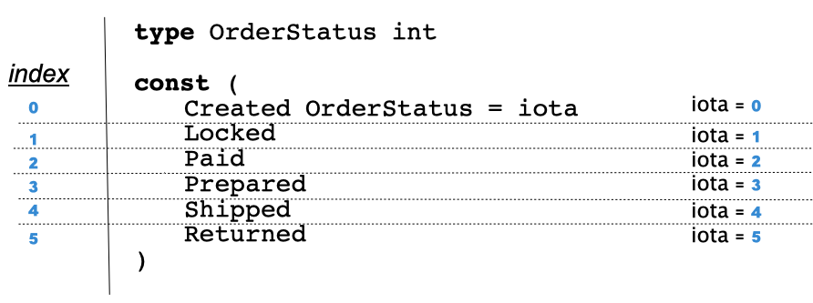
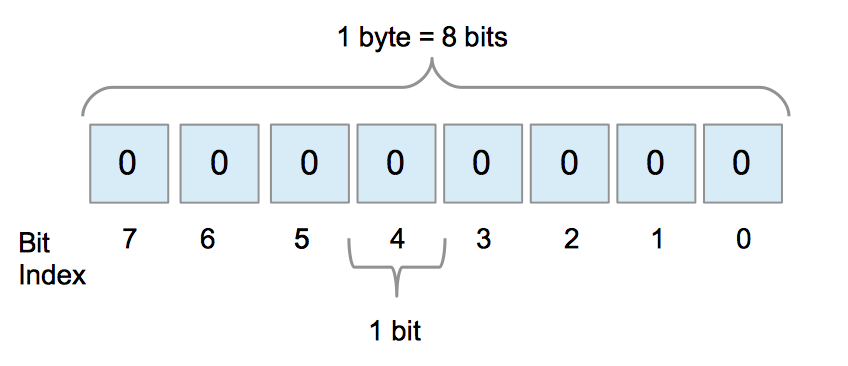
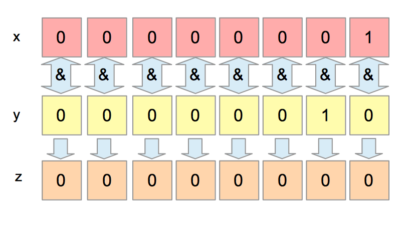
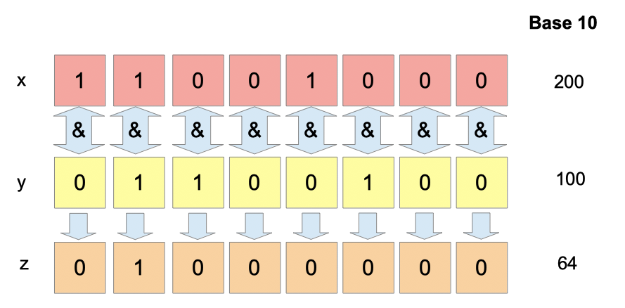
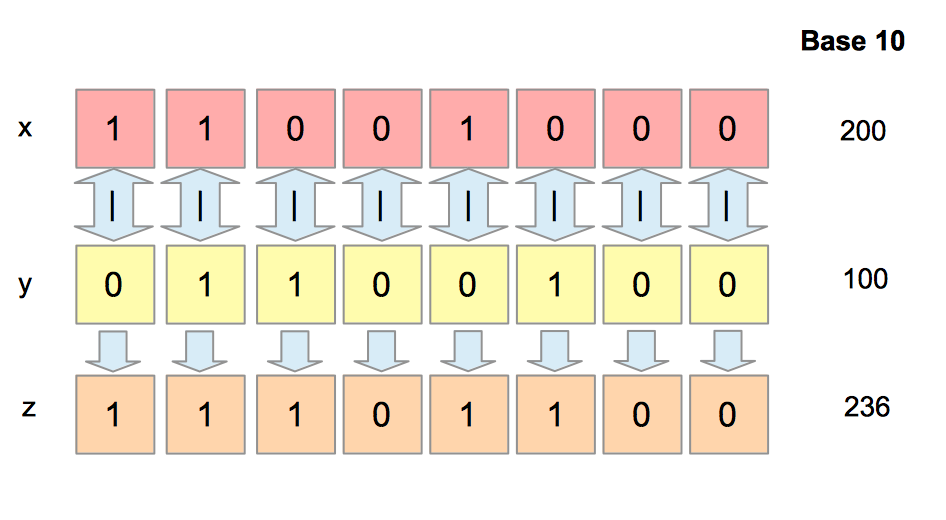
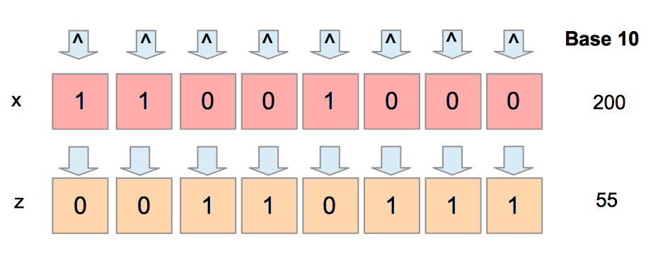
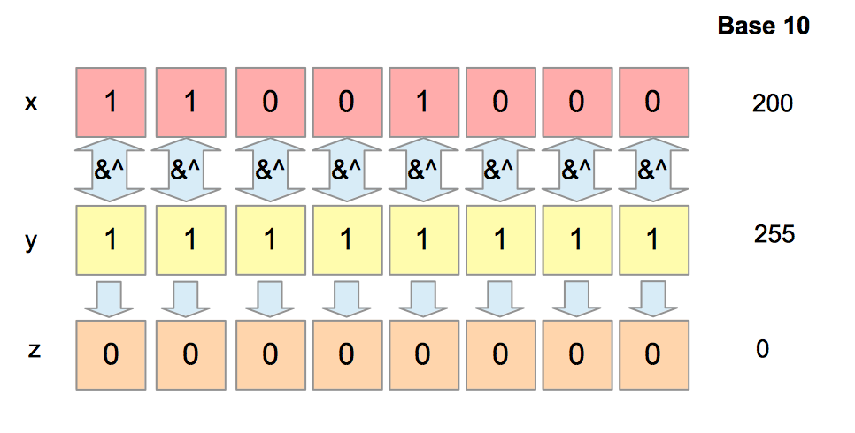
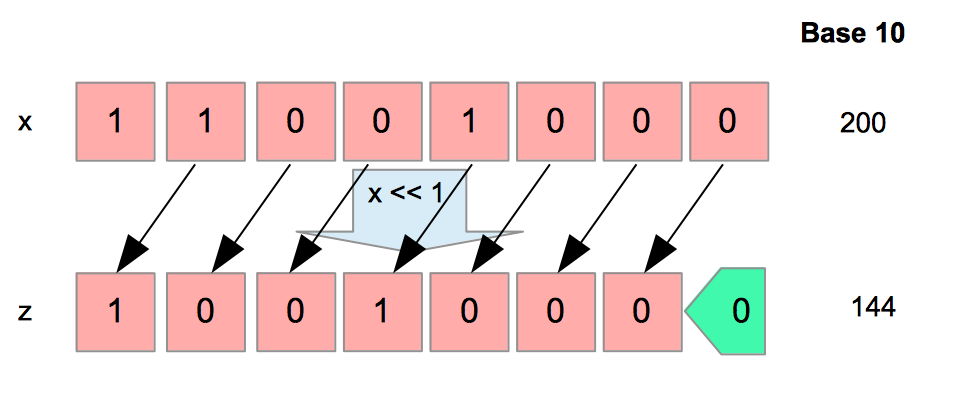
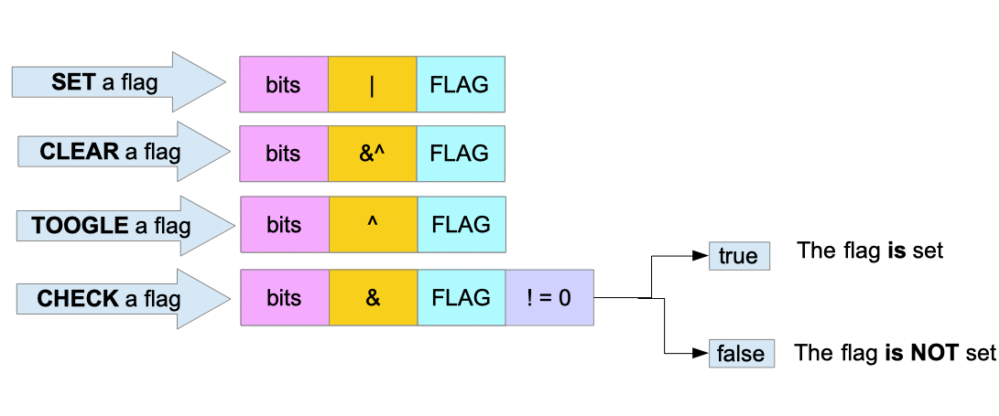

# 第 27 章: 枚举, Iota和位掩码


## 本章中能学到的内容
什么是枚举？

如何在 Go 语言中创建一个枚举类型

什么是 iota，怎么使用？

什么是位操作符？ 怎么使用？

## 本章中提及的技术概念
- **Enum**：枚举
- **Enumeration type**：枚举类型
- **iota**：Go语言的关键字，会随着行数递增
- **index**：索引
- **Byte**：字节
- **bits**：比特、位
- **Binary**：二进制
- **Bitmask**：位掩码
- **Bitflag**：位标志

## 枚举定义

「枚举」（或枚举数据类型）是一种数据类型，该数据类型由一组「由程序员明确定义的值」组成。[^@institute1990ieee](https://www.practical-go-lessons.com/chap-27-enum-iota-and-bitmask#institute1990ieee)

例如，星期几是一种枚举。一周有七天且不超过七天。

## Go语言中的枚举

Go语言（至少在版本1中）没有专门的枚举类型。不过，我们依然可以构建一种类型来提供与枚举相同的功能。

## 构建一种可以用作枚举的类型

我们先看一个 HTTP 方法的例子。

```go
// enum-iota-bitmasks/type-as-enum/main.go 

type HTTPMethod int

const (
    GET     HTTPMethod = 0
    POST    HTTPMethod = 1
    PUT     HTTPMethod = 2
    DELETE  HTTPMethod = 3
    PATCH   HTTPMethod = 4
    HEAD    HTTPMethod = 5
    OPTIONS HTTPMethod = 6
    TRACE   HTTPMethod = 7
    CONNECT HTTPMethod = 8
)
```

- 首先，我们声明了一个新的类型 `HTTPMethod`（其基础类型是整型 `int`）。
- 然后我们创建了9个 `HTTPMethod` 类型的常量
- 每个常量都是 `HTTPMethod` 类型，并且我们用 HTTP 的方法名做为常量名。

### 为什么用整型做为基础类型？

你可以使用别的类型作为基础类型，并不一定要整型。不过，使用整型是比较常见的做法。
- 将两个整数之间进行比较，通常比两个字符串之间的比较更有效率。
- 选择整型可以使用 `itoa`。（见下一节）

### 使用示例

想象你现在有一个处理 HTTP 请求的函数。

在这个函数中，你希望预先定义好一组方法用于处理用户发送过来的 HTTP 请求。那你的函数可以定义一个 `HTTPMethod` 类型的参数（也可以替换成整型 `int`）:

```go
func handle(method HTTPMethod, headers map[string]string, uri string) {}
```
在函数体中，你可以通过枚举值调整处理程序的行为：

```go
func handle(method HTTPMethod, headers map[string]string, uri string) {
    if method == GET {
        fmt.Println("the method is get")
    } else {
        fmt.Println("the method is not get")
    }
}
```

枚举类型也可以被用在结构体中（跟其他任何类型一样）：
```go
// enum-iota-bitmasks/type-as-enum/main.go 

type HTTPRequest struct {
    method  HTTPMethod
    headers map[string]string
    uri     string
}
func main() {
    r := HTTPRequest{
        method: GET, 
        headers: map[string]string{"Accept": "application/json"},
        uri: "/prices",
    }
    fmt.Println(r)
}
```

## 一个完美的解决方案
上一节提出的解决方案**并不完美**，原因如下：
1. **任何** `int` 类型的数值都作为 `HTTPMethod` 类型变量的值：

```go
lolMethod := HTTPMethod(42)
headers := make(map[string]string)
handle(lolMethod,headers,"/prices" )
```
我们创建一个 `HTTPMethod` 变量 `lolMethod`，代码一样可以编译通过。

2. 当我们打印一个 `HTTPMethod` 变量时，输出是一个 `int` 整型值：

```go
log.Println(GET)
// > 0
```

3. 当我们把结构体序列化为 JSON 时，`HTTPMethod` 类型的变量会被当成整型 `int` 打印。

```go
type HTTPRequest struct {
    Method  HTTPMethod `json:"method"`
    Headers map[string]string `json:"headers"`
    Uri     string `json:"uri"`
}

r := HTTPRequest{
    Method: GET, 
    Headers: map[string]string{"Accept": "application/json"}, 
    Uri: "/prices",
}

marshaled, err  := json.Marshal(r)
if err != nil {
    panic(err)
}
```
上面的代码会产生如下的 JSON 字符串：
```go
{
  "method": 0,
  "headers": {
    "Accept": "application/json"
  },
  "uri": "/prices"
}
```
`"method": 0` 的 `0` 可能会被解释为一个错误 `error`，而我们要的是它输出 `"method": "GET"`。

1. 当我们想要反序列化一个 JSON 字符串时，可能会引发一个错误：

```go
jsonB := []byte("{\"method\":\"GET\",\"headers\":{\"Accept\":\"application/json\"},\"uri\":\"/prices\"}")
req := HTTPRequest{}
err = json.Unmarshal(jsonB,&req)
if err != nil {
    panic(err)
}
```
执行后会引发一个 `panic`：

```go
panic: json: cannot unmarshal string into Go struct field HTTPRequest.method of type main.HTTPMethod
```
这是非常正常的，我们输入一个字符串，却想把它转成整型 `int` 输出。其中一种解决办法是构建 `HTTPMethod` 的时候使用字符串作为基础类型。


## 枚举库
为了解决上述问题：
- 我们得能够**检查**值是否存在枚举的定义中
  - 所以我们需要一个方法来检查值
- 我们得能够正确**打印**元素
  - 所以我们需要实现 `fmt.Stringer` 接口
- 我们得能够正确地将枚举值**序列化**成 JSON（或者其他格式）
  - 所以我们需要实现 `json.Marshaler` 接口
- 我们得能够从 JSON 中正确地**反序列化**枚举值
  - 所以我们需要实现 `json.Unmarshaler` 接口


我们可以实现这些接口：
```go
// enum-iota-bitmasks/enum-implementations/main.go 

type HTTPMethod int

func (h HTTPMethod) IsValid() bool {
    panic("implement me")
}

func (h HTTPMethod) String() string {
    panic("implement me")
}

func (h HTTPMethod) MarshalJSON() ([]byte, error) {
    panic("implement me")
}

func (h HTTPMethod) UnmarshalJSON(bytes []byte) error {
    panic("implement me")
}
```
不过这样手写挺无聊的，我们可以使用一个库来做这些事情。我快速搜索一下 GitHub，似乎看到了两个库：
- [https://github.com/alvaroloes/enumer](https://github.com/alvaroloes/enumer)
- [https://github.com/abice/go-enum](https://github.com/abice/go-enum)

这两个库可以为你生成这些方法，不过使用方式是通过命令行。

> 请注意，枚举是 Go 语言版本 2 的新特性。

## iota

在前面的小节中：
- 我们需要给每一个常量赋一个字面量整数值
- 每一行都需要显式的写上 `HTTPMethod` 

为省略上面两个繁琐的工作，我们可以在枚举的定义中使用 `iota`：

```go
// enum-iota-bitmasks/iota/main.go
package main

import "fmt"

type HTTPMethod int

const (
    GET     HTTPMethod = iota
    POST    HTTPMethod = iota
    PUT     HTTPMethod = iota
    DELETE  HTTPMethod = iota
    PATCH   HTTPMethod = iota
    HEAD    HTTPMethod = iota
    OPTIONS HTTPMethod = iota
    TRACE   HTTPMethod = iota
    CONNECT HTTPMethod = iota
)

func main() {
    fmt.Println(PUT)
    // 2
}
```
我们还可以继续简化上面的代码，通过使用隐式重复属性，可以避免每次重复 `HTTPMethod = iota` 。这个隐式重复属性非常方便，它能让你在一个常量集 `const(...)` 中，只需给**第一个**常量赋值，但效果跟全部赋值是一样的：

```go
// enum-iota-bitmasks/iota-improvement/main.go 

const (
    GET HTTPMethod = iota
    POST
    PUT
    DELETE
    PATCH
    HEAD
    OPTIONS
    TRACE
    CONNECT
)
```

### iota 的原理
- 「iota 表示联系的非类型化整数常量」[^@go-specs]
- 这意味着 iota 总是一个整数；例如，不可能用 iota 来构造浮点数。
- 它的值是该常量声明中相应的 ConstSpec 的索引[^@go-specs]

iota 的值由常量声明中常量的索引决定。在上面的例子中，POST 是第二个被定义的常量，那么它的值为 1 。为什么是 1？为什么不是 2？这是因为 iota 的第三个属性：
- 从 0 开始 [^@go-specs]

iota 的初始值为 0 , 举个例子：
```go
type TestEnum int

const (
    First TestEnum = iota
    Second
)

fmt.Println(First)
// 0
```

虽然 iota 的初始值为 0 , 但如果你想要你的枚举元素的值不是从 0 开始增长，你可以像下面这样声明：

```go
type TestEnum int

const (
    First TestEnum = iota + 4
    Second
)

fmt.Println(First)
// 4 (0+4)
```

你也可以让 iota 乘一个整数：
```go
type TestEnum int

const (
    First TestEnum = iota * 3
    Second
    Third
)

fmt.Println(Second) // 3 (1*3)
fmt.Println(Third)  // 6 (2*3)
```




## Byte 字节 和 Bit 比特

一个字节由8个比特组成。一个比特就是一个二进制数字，要么等于 0 要么等于 1 。

> 译者注：中文里的比特、位、二进制位，都表示 bit 。



位的索引不像我们从左到右的阅读习惯，而是从右到左。

## 位操作
进入位运算符的学习之前，我们要先学会如何打印数字的二进制表示。

### 打印二进制
要打印二进制，你可以使用 `fmt.Printf()` 函数，并在格式化字符串中指定如 `%08b` 。08 表示最多打印 8 个二进制位。

```go
// enum-iota-bitmasks/print-bits/main.go
package main

import "fmt"

func main() {
    var x uint8
    x = 1
    fmt.Printf("%08b\n", x)
    //00000001
    x = 2
    fmt.Printf("%08b\n", x)
    //00000010
    x = 255
    fmt.Printf("%08b\n", x)
    //11111111
}
```
在上面的例子中，我们定义了 `x` ，一个8位的无符号整型变量 `uint8`。`x` 可以存储 0 到 255。我们先是给 `x` 赋值 1，然后是 2 ，最后是 255 。每赋值一次就打印一次。

### 按位操作符
要操作每一个二进制位，我们需要对应的操作符。在这一小节中，我们把这些操作符称作 「位运算符 （Bitwise Operators）」，下面我们将逐一介绍这些运算符。位操作乍一听好像很吓人，但它们只不过是一些布尔逻辑运算。如果你已经对 `与 AND`、`或 OR`、`异或 XOR` 这些比较熟悉，下面的内容就比较好理解了。

一个操作可以分解为三个元素：
- 操作符（Operator）
- 操作数（Operands）
- 操作结果（Result）

例如这样一条位操作语句，`x | y = z`：
- `x` 和 `y` 是操作数
- `|` 是操作符
- `z` 是操作结果

上面的解释适用于每一个操作符。位操作在操作数的每个位上独立执行。

> 译者注
> 例如：
> $$
> \begin{array}{cc}
>     \mathrm{} & \mathrm{01} \\
>     \mathrm{AND} & \mathrm{01} \\
>     \hline \\
>     \mathrm{} & \mathrm{01}
> \end{array}
> $$
> 两个 1 做与运算并不会影响两个 0，因为它们各自都是独立执行的。

不要把位运算符和逻辑运算符（`&&`、`||`、`!`）混淆，这些逻辑运算符用于从左到右比较布尔值。

#### 按位与 (AND) 操作符：`&`
如果 `x` 和 `y` 是两个二进制位，只有在 `x` 和 `y` 都为 1 时，`x & y` 的结果为 1。其他情况 `x & y` 结果都是 0。

记住，只有两个操作数**都**为真时结果才为真。

| x | y | x&y |
|---|---|-----|
| 0 | 0 | 0   |
| 0 | 1 | 0   |
| 1 | 0 | 0   |
| 1 | 1 | 1   |

我们先一起看个例子：
```go
// enum-iota-bitmasks/bitwise-operations/main.go 

var x, y, z uint8
x = 1 // 二进制形式为 00000001
y = 2 // 二进制形式为 00000010
z = x & y

// 打印二进制
fmt.Printf("%08b\n", z)
// 00000000

// 打印十进制
fmt.Printf("%d\n", z)
// 0
```
上面例子先创建了三个 `uint8` 型变量（`x`、`y`、`z`），然后把 `x & y` 的结果保存在 `z` 中。



如上面图所示，我们分别获取每个二进制位，然后计算每个位的结果：

`1 & 0 = 0`
`0 & 1 = 0`
`0 & 0 = 0`
`0 & 0 = 0`
`0 & 0 = 0`
`0 & 0 = 0`
`0 & 0 = 0`
`0 & 0 = 0`

注意，我们是从右边开始操作的。像手算两个数加减乘除一样从右算起，这也是位操作的规则。

我们再看另一个例子：
```go
// enum-iota-bitmasks/bitwise-operation-and/main.go 

var x, y, z uint8
x = 200 // 二进制形式为 11001000
fmt.Printf("%08b\n", x)

y = 100 // 二进制形式为 01100100
fmt.Printf("%08b\n", y)

z = x & y

// 打印二进制
fmt.Printf("%08b\n", z)
// 01000000

// 打印十进制
fmt.Printf("%d\n", z)
// 64
```
请结合下面的图片理解上面代码的运算过程。



#### 按位或 (OR) 操作符：`|`

如果 `x` 和 `y` 是两个二进制位，只有在 `x` 和 `y` 都为 0 时，`x | y` 的结果为 0 。其他情况 `x | y` 结果都是 1 。

| x | y | x\|y |
|---|---|------|
| 0 | 0 | 0    |
| 0 | 1 | 1    |
| 1 | 0 | 1    |
| 1 | 1 | 1    |

我们先一起看个例子：

```go
// enum-iota-bitmasks/bitwise-or/main.go 

var x, y, z uint8
x = 200 // 二进制形式为 11001000
fmt.Printf("%08b\n", x)

y = 100 // 二进制形式为 01100100
fmt.Printf("%08b\n", y)

z = x | y

// 打印二进制
fmt.Printf("%08b\n", z)
// 11101100

// 打印十进制
fmt.Printf("%d\n", z)
// 236
```


从上图可以看到，我们从右边开始一个位接着一个位的进行或运算：

`0 | 0 = 0`
`0 | 0 = 0`
`0 | 1 = 1`
`1 | 0 = 1`
`0 | 0 = 0`
`0 | 1 = 1`
`1 | 1 = 1`
`0 | 1 = 1`

用十进制操作数进行位操作看不出什么意义，我们用二进制操作数表示一下：
```go
11001000 | 01100100 = 11101100
```


#### 按位异或 (XOR) 操作符：`^`

按位异或，英文为 **XOR** ，源自 e**X**clusive **OR**，表示排他性的按位或运算符。为什么有了一个按位或运算符 (OR) 还需要再来一个排他性的按位或运算符 (XOR)？这里你先记住使用按位或运算 (OR) 我们可以得到 `1 | 1 = 1`。

当两个操作数都为真，结果也为真。有时候这种结果我们并不想要，那我们需要处理一些特例。

使用按位异或运算 (XOR) 我们可以得到 `1 ^ 1 = 0`。说得更准确点，只有当一个操作数等于 1 时，`x ^ y` 才等于 1 。

| x | y | x^y |
|---|---|-----|
| 0 | 0 | 0   |
| 0 | 1 | 1   |
| 1 | 0 | 1   |
| 1 | 1 | 0   |

两个**相同**的操作数，按位异或的结果为 0 ;
两个**不同**的操作数，按位异或的结果为 1 。

> 译者注：相同为 0，不同为 1，这也许就体现了为什么叫 按位异或、排他性的按位或运算。
```go
// enum-iota-bitmasks/bitwise-xor/main.go 

var x, y, z uint8
x = 200 // 二进制形式为 11001000
fmt.Printf("%08b\n", x)

y = 100 // 二进制形式为 01100100
fmt.Printf("%08b\n", y)

z = x ^ y

// 打印二进制
fmt.Printf("%08b\n", z)
// 10101100

// 打印十进制
fmt.Printf("%d\n", z)
// 172
```

#### 按位取反 (NOT) 操作符：`^`
按位取反操作符 (NOT) 与按位异或操作符 (XOR) 相同，只不过它只需要**一个操作数**。它很容易记住，因为取反操作符反转每个比特存储的值。

| x | ^x |
|---|----|
| 0 | 1  |
| 1 | 0  |

按位取反操作符会反转每一个比特的值，看下面的例子：
```go
// enum-iota-bitmasks/bitwise-not/main.go 

var x, z uint8
x = 200 // 二进制形式为 11001000
fmt.Printf("%08b\n", x)

z = ^x

// 打印二进制
fmt.Printf("%08b\n", z)
// 00110111

// 打印十进制
fmt.Printf("%d\n", z)
// 55
```



#### 按位清零 (AND NOT) 操作：`&^`

如果右操作数的相应位设置为 1，则使用按位清零操作 (AND NOT) 可以将左操作数的位设置为 0。这么说可能不太好理解，我们看下面的图:



按位清零操作是两个操作符 `按位与 AND` 和 `按位取反 NOT` 的组合。我们可以将其拆解：

- `x AND NOT y` 等价于 `x AND (NOT y)`

我们尝试一下用这种拆解，得到与上图同样的操作结果：

- x = 11001000
- y = 11111111
- NOT y = 00000000
- `x AND NOT y` 等价于 `11001000 AND 00000000 = 00000000`


#### 按位左移、按位右移 操作符：(`<<`，`>>`)

这两个操作符用于将二进制位向左或向右**移动**。

使用这两个操作符你得指定左操作数的二进制位需要偏移的位数。

##### 左移
```go
// enum-iota-bitmasks/bitwise-left-shift/main.go 

var x, n, z uint8
x = 200 // 二进制形式为 11001000
fmt.Printf("%08b\n", x)

// 偏移的位数
n = 1
z = x << n
// 打印二进制
fmt.Printf("%08b\n", z)
// 10010000

// 打印十进制
fmt.Printf("%d\n", z)
// 144
```
在上面的例子中，我们将 11001000 左移了一位，得到的操作结果是 1001000**0**。我们在 `x（二进制形式）` 的右边添加了一个 0，并将 x 左移了一个位值。如下图所示：



因为我们的数值保存在 8 位（1字节）的整型中，所以当我们左移的时候丢失了一个二进制位的信息。

如果想避免这种情况，我们可以将数值保存在 16 位（2字节）的整型中：

```go
var x, n, z uint16
x = 200 // 二进制形式为 11001000
fmt.Printf("%08b\n", x)

// 偏移的位数
n = 1
z = x << n
// 打印二进制
fmt.Printf("%b\n", z)
// 110010000

// 打印十进制
fmt.Printf("%d\n", z)
// 400
```
有没有发现一个很有趣的事情：按拉左移操作相当于乘 2
```go
200 << 1 = 400
```
当你将一个数的二进制形式左移 n 位时，相当于将这个数的十进制形式乘以 $2^n$。

例如，当你左移3位，你能得到这个数乘以 $2^3$，也就是乘以 8。

```go
var x, n, z uint16
x = 200 // 二进制形式为 11001000
fmt.Printf("%08b\n", x)

// 偏移的位数
n = 3
z = x << n
// 打印二进制
fmt.Printf("%b\n", z)
// 11001000000

// 打印十进制
fmt.Printf("%d\n", z)
// 1600
```
##### 右移

按位右移操作符 `>>` 能将一个数的二进制位向右移动。

```go
// enum-iota-bitmasks/bitwise-right-shift/main.go 

var x, n, z uint8
x = 200 // 二进制形式为 11001000
fmt.Printf("%08b\n", x)

// 偏移的位数
n = 3
z = x >> n
// 打印二进制
fmt.Printf("%08b\n", z)
// 00011001

// 打印十进制
fmt.Printf("%d\n", z)
// 25
```
可以看出，当我们把 200 进行右移时，我们把 200 除 2 进行了三次，也就是除以 $2^3$，即 $200 \div 8 = 25$。

这就是二进制数的另一个特性，按位左移操作相当于乘 2，按位右移操作相当于除 2。

二进制左移 n 位相当于 $十进制 \times 2^n$；二进制右移 n 位相当于 $十进制 \div 2^n$。

## 位掩码（进阶）

想像一下你现在要创建一个函数，这个函数需要配置八个布尔值：

1. 是否启用详细模式（verbose mode）？
2. 是否从磁盘加在配置？
3. 是否需要数据库连接？
4. 是否启用日志记录（logger）？
5. 是否启用调试模式（debug mode）？
6. 是否支持浮点数（support for float）？
7. 是否启用恢复模式（recovery mode）？
8. 是否失败时重新启动？

一个函数放这么多个参数显然不优雅，我们倒是可以只传递一个整数值，这个整数值可以表示配置。

例如， 0111001（十进制的 113 ）可以表示以下配置：

1. （1）启用详细模式
2. （0）不从磁盘加载配置
3. （0）不需要数据库连接
4. （1）不启用日志记录
5. （1）启用调试模式
6. （1）支持浮点数
7. （1）启用恢复模式
8. （0）失败时不重新启动

> 记住，当涉及二进制时，我们从右向左读取。

使用这种方式有什么优点呢？

- 提高了代码的可读性，只传递了 1 个参数而不是 8 个。
- 节省内存。如果用 8 个布尔值，则需要 $8 \times 8 = 64$ 个二进制位，而我们这种方式只需要 8 个二进制位。

我们先使用按位左移操作，定义好第一个配置值等于 1 （00000001），接着对于后续每个配置变量也进行按位左移操作。

```go
type MyConf uint8

const (
    VERBOSE             MyConf = 1 << iota
    CONFIG_FROM_DISK
    DATABASE_REQUIRED
    LOGGER_ACTIVATED
    DEBUG
    FLOAT_SUPPORT
    RECOVERY_MODE
    REBOOT_ON_FAILURE
)
```
上面的常量声明生成的值如下：

| 常量                | 值           |
|---------------------|--------------|
| `VERBOSE`           | 0000000**1** |
| `CONFIG_FROM_DISK`  | 000000**1**0 |
| `DATABASE_REQUIRED` | 00000**1**00 |
| `LOGGER_ACTIVATED`  | 0000**1**000 |
| `DEBUG`             | 000**1**0000 |
| `FLOAT_SUPPORT`     | 00**1**00000 |
| `RECOVERY_MODE`     | 0**1**000000 |
| `REBOOT_ON_FAILURE` | **1**0000000 |

我们将每个常量都在前一个的基础上左移了一位。

> 还记得吗？每出现一个新的常量声明，iota 就自增 1。 

上面的代码和下面的代码是等价的。

```go
// enum-iota-bitmasks/flags/main.go 

type MyConf uint8

const (
    VERBOSE           MyConf = 1 << 0
    CONFIG_FROM_DISK  MyConf = 1 << 1
    DATABASE_REQUIRED MyConf = 1 << 2
    LOGGER_ACTIVATED  MyConf = 1 << 3
    DEBUG             MyConf = 1 << 4
    FLOAT_SUPPORT     MyConf = 1 << 5
    RECOVERY_MODE     MyConf = 1 << 6
    REBOOT_ON_FAILURE MyConf = 1 << 7
)
```

### 使用配置

接下来我们就可以使用我们的配置枚举类型 `MyConf` 了。

```go
// enum-iota-bitmasks/flags/main.go 

func MyComplexFunction(conf MyConf, databaseDsn string) {
    //...
}
```
现在配置值只是一个 `MyConf` 类型（基础类型是 uint8）的参数。

当我们调用配置函数 `MyComplexFunction` 的时候，只需要提供所需要的 flags 即可：

```go
MyComplexFunction(VERBOSE | REBOOT_ON_FAILURE, "mysql...")
```
这条语句等于是告诉函数我们要启用详细模式（VERBOSE）、失败时要重新启动（REBOOT_ON_FAILURE）。

`VERBOSE | REBOOT_ON_FAILURE` 的值为 `10000001`。只有两个比特被设置为 1，一个是 `VERBOSE`，另一个是 `REBOOT_ON_FAILURE`。

> 译者注： flag，意为标记，MyConf 中的每一个常量就是一个 flag。

### 读取配置值

要检查是否设置了 flag，我们可以使用按位与操作 (AND)。例如，我们要检查配置值 `conf` 是否设置了“失败时要重新启动”，可以像下面这样检查：

```go
conf & REBOOT_ON_FAILURE != 0
```
如果上面这个表达式为真，则意味着调用者设置了 `REBOOT_ON_FAILURE` 失败时要重新启动。

我们继续看一个例子：

```go
// enum-iota-bitmasks/flags/main.go 

func main(){
    // 调用配置函数 MyComplexFunction
    MyComplexFunction(VERBOSE|REBOOT_ON_FAILURE, "test")
}

// 定义配置函数 MyComplexFunction
func MyComplexFunction(conf MyConf, databaseDsn string) {
    fmt.Printf("conf : %08b\n", conf)

    test := conf & REBOOT_ON_FAILURE
    fmt.Printf("test : %08b\n", test)

    test2 := conf & CONFIG_FROM_DISK
    fmt.Printf("test2: %08b\n", test2)
}
```
执行上面的代码可以得到以下输出：

```go
conf : 10000001
test : 10000000
test2: 00000000
```

变量 `test` 不等于 0（二进制形式为 00000000），说明调用者设置了 `REBOOT_ON_FAILURE`。

变量 `test2` 等于 0，说明调用者不启用 `CONFIG_FROM_DISK` 。


### 切换特定位标志

要切换特定的位标志，我们可以使用按位异或操作符 (XOR)：`^`。

举个例子，假设用户调用的时候没有设置支持浮点数，也就是没有设置 flag `FLOAT_SUPPORT`，但你希望它启用这项配置，那你可以在函数中使用异或操作来实现：

```go
func main(){
    // 调用配置函数 MyComplexFunction
    MyComplexFunction(VERBOSE|REBOOT_ON_FAILURE, "test")
}

// 定义配置函数 MyComplexFunction
func MyComplexFunction(conf MyConf, databaseDsn string) {
    fmt.Printf("conf : %08b\n", conf)

    test := conf & FLOAT_SUPPORT
    fmt.Printf("test : %08b\n", test)

    fmt.Print("---切换特定位标志 FLOAT_SUPPORT---\n")

    // 切换特定位标志 FLOAT_SUPPORT 为激活状态
    conf = conf ^ FLOAT_SUPPORT
    fmt.Printf("conf : %08b\n", conf)

    test = conf & FLOAT_SUPPORT
    fmt.Printf("test : %08b\n", test)
}
```
上面的代码会产生如下的输出：
```go
conf : 10000001
test : 00000000
---切换特定位标志 FLOAT_SUPPORT---
conf : 10100001
test : 00100000
```

> 译者注
> $$
> \begin{array}{cc}
>     \mathrm{} & \mathrm{10000001} \\
>     \mathrm{XOR} & \mathrm{00100000} \\
>     \hline \\
>     \mathrm{} & \mathrm{10100001}
> \end{array}
> $$
> $$
> \begin{array}{cc}
>     \mathrm{} & \mathrm{10100001} \\
>     \mathrm{XOR} & \mathrm{00100000} \\
>     \hline \\
>     \mathrm{} & \mathrm{10000001}
> \end{array}
> $$
> 按位异或操作可以切换位标志，再异或一次可以切换回来。
> 
> 换句话说，按位异或可以激活一个调用者没有设置的配置项，也可以注销一个调用者已经设置的配置项。

### 清除特定位标志
使用按位清零操作 (AND NOT) 可以将配置值清零，也就是变成未激活该配置项。

请看下面的例子：

```go
func main(){
    // 调用配置函数 MyComplexFunction
    MyComplexFunction(VERBOSE|REBOOT_ON_FAILURE, "test")
}

// 定义配置函数 MyComplexFunction
func MyComplexFunction(conf MyConf, databaseDsn string) {
    fmt.Printf("conf : %08b\n", conf)

    test = conf & REBOOT_ON_FAILURE
    fmt.Printf("test : %08b\n", test)

    fmt.Print("---清除特定位标志 REBOOT_ON_FAILURE---\n")

    // 清除特定位标志 REBOOT_ON_FAILURE 为未激活状态
    conf = conf &^ REBOOT_ON_FAILURE
    fmt.Printf("conf : %08b\n", conf)

    test = conf & REBOOT_ON_FAILURE
    fmt.Printf("test : %08b\n", test)
}
```
上面的代码会产生如下的输出：
```go
conf : 10000001
test : 10000000
---清除特定位标志 REBOOT_ON_FAILURE---
conf : 00000001
test : 00000000
```

### 总结




## 自我测试
### 例题

```go
//snippet 1
type Elem uint8

const (
    OptB Elem = iota + 5
    OptA
    OptC
)
```

1. Go语言版本 1 是否支持枚举类型？
2. 代码中 `OptA` 的值是多少?
3. 写出 AND，OR，XOR，NOT，AND NOT 的按位操作符号。
4. `OptC` 是什么类型?
5. 二进制数字向左移位的按位运算符是哪个?
6. 将二进制数字偏移到左边的按位运算符是哪个?

### 解析

1. Go语言版本 1 是否支持枚举类型？
   1. 否
   2. Go语言版本 1 中使用枚举需要自己实现。
2. 代码中 `OptA` 的值是多少?
   1. 6。（1+5）
3. 阐述 AND, OR, XOR, NOT, AND NOT 都是什么?
   1. AND：`&`
   2. OR：`|`
   3. XOR：`^`
   4. NOT：`^`
   5. AND NOT：`&^`
4. `OptC` 是什么类型?
   1. `Elem`
5. 二进制数字向左移位的按位运算符是哪个?
   1. `<<`
6. 将二进制数字偏移到左边的按位运算符是哪个?
   1. `>>`

## 要点


- 枚举类型（或枚举）是由一组显式定义的值组成的数据类型。
  - 例：一周中的几天
  - 例：一年中的月份
  - 例：电子商务订单的状态（已创建、已锁定、已付款、已发货……）
- Go 版本 1 不支持开箱即用的枚举类型。
- 但是，您可以按照此步骤创建一个枚举类型 E
  - 声明一个新的类型 E
  - 指定 E 的基础类型为 int
  - 定义一个 E 类型的常量集
  - 第一个常量的值为 0，第二个为 1，依次类推
  - 每个常量都是一个枚举元素，给他们相应的命名
  - E 需要实现以下接口：`json.Marshaler`、`json.Unmarshaler`、`fmt.Stringer`（如果使用 JSON，如果在应用中使用其他编组格式，则需要实现所需的接口）。
  - 可以使用第三方库帮你实现这些接口
- `iota` 是一个预先声明的标识符。它表示连续的无类型整数常量。
- 我们可以在常量的“分组”中使用它。
- 它的值从零开始，等于常量的索引。
- 位是二进制数字 (0 or 1)，也称做比特、二进制位
- 一个字节 8 个位
- Go 具有按位逻辑和移位运算符。我们只能将它们与整数一起使用
  - `&` : AND
  - `|` :OR
  - `^` :XOR
  - `&^` :AND NOT
  - `<<` :left shift
  - `>>` :right shift
- 一个 `uint8` 以 8 位存储在内存中
- 可以使用 uint8 将一组 8 个布尔参数传递给函数或方法
  - 我们可以使用按位运算符来检查这些布尔参数的值。


## 参考文献
[^institute1990ieee] Electrical, Institute of, and Electronics Engineers. 1990. “IEEE Standard Glossary of Software Engineering Terminology: Approved September 28, 1990, IEEE Standards Board.” In. Inst. of Electrical; Electronics Engineers.
[^go-specs] “The Go Programming Language Specification.” n.d. Accessed April 30, 2018. https://golang.org/ref/spec.
