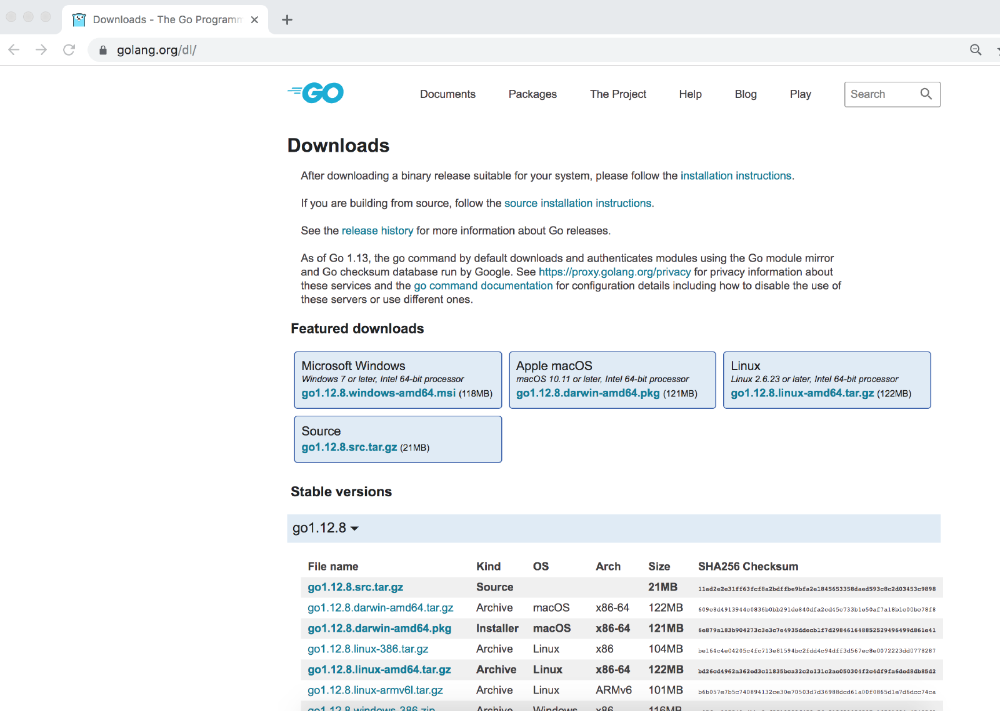
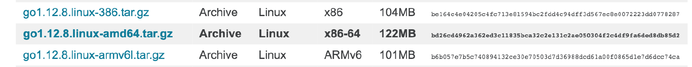
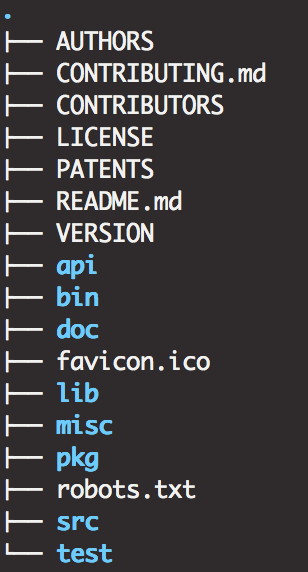
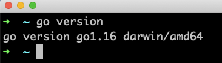
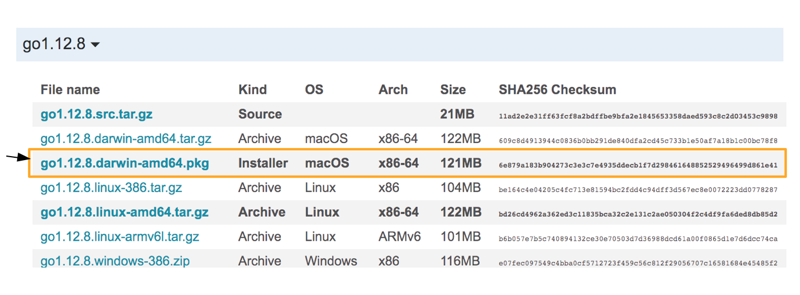
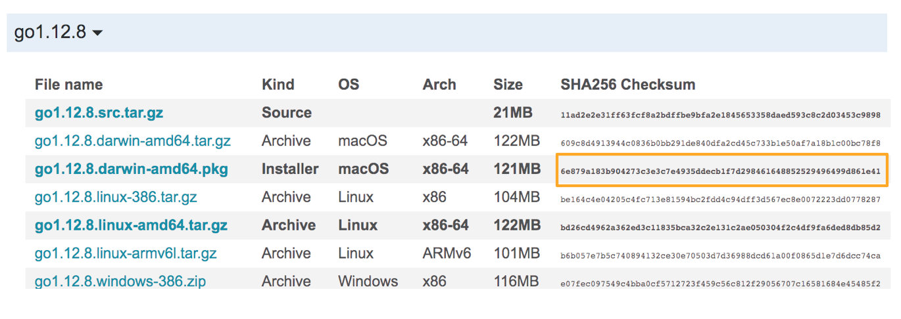
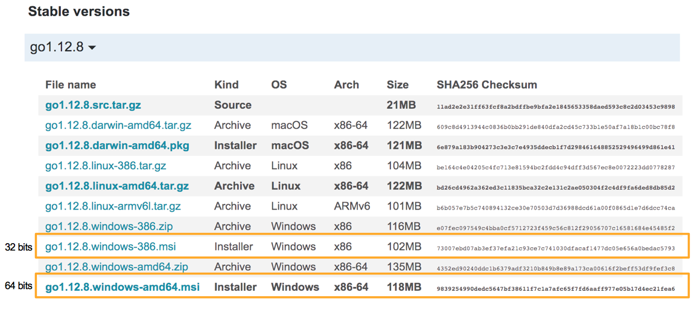

# Chapter 4: 安装开发环境


## 1 你将在本章学到什么

- 如何在你的计算机上安装 Go
- 如何计算校验和（SHA 256）

## 2 涵盖的技术概念

- 计算机体系架构
- 哈希函数
- 压缩/解压
- Shell 配置
- PATH 环境变量

## 3 引言

为了编写 Go 语言程序，你需要一个编辑器。为了测试、编译、格式化你的 Go 语言程序以及为其编写文档，你需要安装 Go 工具链。

本章将指导你逐步地完成 Go 工具链的安装过程。

## 4 计算机体系架构

在接下来部分中，你将需要了解你的**计算机体系架构**。这个技术术语有时会给新手带来困惑。它究竟是什么？

计算机有不同的外观、价格和类型。许多消费者关注计算机的品牌及其高级规格（如 RAM、硬盘驱动器上的存储量）。处理器的问题有时会被营销所回避，但它是计算机的一个基本组成部分。处理器也被称为 CPU（Central Processing Unit）。

CPU 负责运行系统指令和程序。CPU 是一个通用术语，市面上有不同类型的 CPU 可用。

计算机程序使用一组预定义的指令与机器对话，我们称之为指令集。一些处理器共享相同的指令集，而其他则完全不同。计算机体系架构的概念涵盖指令集和计算机上物理介质的组织方式以及计算机系统的实现。

你现在明白为什么这个概念在机器级别是必不可少的。Go 工具链是我们用来构建 Go 语言程序的一系列程序的集合。

- 这些程序是用 Go 编写并编译的。
- Go 团队为每个支持的操作系统和架构提供不同版本的工具链
  - Go 有支持的最低操作系统版本的要求
  - 你可以在此页面进行查看：
    - https://github.com/golang/go/wiki/MinimumRequirements
    - 此页面会频繁地更新

## 5 Go 工具链安装

开始开发 Go 语言程序之前，你必须首先在你的计算机上安装 Go。为了安装它，你必须下载一个文件。根据你的 OS（操作系统），安装过程略有不同。只需按照与你的操作系统相对应的步骤操作即可。

第一步（不依赖于你的操作系统）是去官方下载页面：https://golang.org/dl/。 顺便说一下，golang.org 是 Go 的官方网站，我们强烈建议你仅从此 URL 下载 Go。


Go 下载页面

在本节中，我们将分别介绍 Linux、macOS 和 Windows 上 Go 工具链的安装。另外，Go 也支持 FreeBSD。

### 5.1 Linux
#### 5.1.1 确定你的计算机架构

你必须首先确定计算机的体系结构，它将帮助你选择下载正确的文件。

打开终端并输入以下命令：
```
$ uname -p
```
Uname 是一个用于显示系统特性的程序，标志 -p 表示打印机器的处理器的架构名字。

Golang Linux 版本可用于以下架构：
- x86
- x86-64
- ARMv6
- ARMv8
- ppc64le
- s390x

#### 5.1.2 下载安装包

确定你的计算机架构后，你现在能够在 Go 官网下载相应的存档文件。


Linux 可用下载文件

你只需要点击蓝色的链接，下载将自动开始。

在接下来的部分中，我们将在架构为 x86-64 的机器上安装 Go 的 1.12.8 版本。除了文件的名称不同外，其他架构和其他版本的安装指令是一样的。

#### 5.1.3 检查文件哈希

强烈建议执行此步骤，目的是检查你下载的文件是否有损坏。为此，打开终端并输入：
```
$ cd /where/you/have/downloaded/the/file
$ sha256sum go1.12.8.linux-amd64.tar.gz
```
第一个命令使用 cd （切换目录）进入到你下载的文件所在的目录。例如，如果文件在 /home/max/，你需要执行：
```
$ cd /home/max
```
下一个命令将计算文件 go1.12.8.linux-amd64.tar.gz 的 SHA256 哈希（一个加密哈希函数）。

**加密散列函数**：一种将可变大小数据（文件、单词、句子）作为输入并输出一块固定大小的数据的函数。通过输出的数据，几乎不可能计算出函数的输入。这个结果被称为 "散列" 或 "消息摘要" 。这里我们使用它来确保文件在下载到计算机的过程中没有被修改。为此，我们将在计算机上计算的哈希值与 Go 官网上提供的哈希值进行比较。如果两者相等，就没有被修改。

执行 sha256sum 后，你将在屏幕上看到一组字符，你必须将这些字符与网站上显示的哈希值进行比较。如果不相同，则下载过程中文件出现问题，请勿使用下载的文件。如果你计算出的哈希值与 Go 官网上显示的哈希值相等，那么你就可以开始了。

#### 5.1.4 解压安装包

安装包是用 gzip 压缩的（用 gzip 压缩的文件，通常称为 tarball ），解压有两种方式：

1. 使用图形界面（如果有）：双击存档，将打开一个窗口。按照提示指令操作， 你必须提取和解压安装包到 /usr/local 目录

2. 使用终端。

我们使用第 2 种方式，打开你的终端并输入命令：
```
$ sudo tar -C /usr/local -xzf go1.12.8.linux-amd64.tar.gz
```
我们使用 tar 应用（sudo 模式）

- -C /usr/local：表示我们将改变执行目录为 /usr/local
- -xzf go1.12.8.linux-amd64.tar.gz：表示我们想要提取用 gzip 压缩的文件 go1.12.8.linux-amd64.tar.gz

#### 5.1.5 设置 PATH 环境变量

让我们看一下 /usr/local/go 目录文件的树形结构图：


/usr/local/go 目录树形结构图

一共有八个目录：api，bin，doc，lib，misc，pkg，src，test。

bin 目录包含三个可执行文件：

- go：主执行文件
- godoc：这个程序用于生成文档[<sup>1](#1)
- gofmt: 这个程序用于根据语言约定格式化你的源码文件

进入 bin 目录，你可运行 go。尝试以下命令：
```
$ ./go version
```

它将打印 go 版本, 但我们并不满足于这一点。我们希望能够打开一个终端，随时随地运行 `go --version`。为此，我们需要将此目录添加到 PATH 中。

**PATH**：一个名为PATH的环境变量，其中包含一个目录列表，当用户发出命令时，shell 将在其中搜索可执行文件。你经常会听到“将此目录添加到路径”，这意味着你必须将此目录附加到 PATH 环境变量中的目录列表中。

下面的命令将`/usr/local/go/bin`附加到 PATH 变量：

```
$ export PATH=$PATH:/usr/local/go/bin
```

我们使用 PATH 变量中已经包含的值（用 $PATH 表示）并在其后面附加字符 “:/usr/local/go/bin” 设置变量 PATH（使用export命令）。假如你在同一个打开的终端输入：
```
$ go version
```
你将看到打印的 Go 版本。


go 版本

**修改你的 shell 配置**

现在，如果你关闭终端并打开另一个，你将注意到它不再生效。PATH 变量的修改仅为当前终端会话生效，当打开另一个终端时，将创建一个新会话，对 PATH 变量的修改不会传递到新的会话。

要为每个新会话修改 PATH 变量，必须更改 shell 配置文件。你需要在配置文件的开头添加“export PATH=$PATH:/usr/local/go/bin”。

- 如果你使用的是 bash，修改的文件是 ~/.bashrc，无论何时开始一个新会话它都会生效
- 如果你使用的 zsh，修改的文件是 ~/.zshrc，无论何时开始一个新会话它都会生效
- 如果你使用的其他 shell，请参阅提供的文档，但工作原理应该是一样的

当修改了 .bashrc 或者 .zhsrc 后， 改变不会立即生效，你需要打开一个新的会话查看效果。

如果你不想打开一个新的会话，你可以输入以下命令并回车：
```
$ source ~/.bashrc
```

**验证安装**

打开一个终端，查询 go 当前的安装版本：
```
$ go version
```
该命令应打印 go 版本号。

### 5.2 macOS

主要有两种方式安装 go：
- 使用安装程序
- 下载二进制文件并自行安装。

第三种方式是从源代码编译 go。为了简单起见，我们将向你展示如何使用安装程序安装 go。

#### 5.2.1 下载安装程序

到 https://golang.org/dl/ 下载你想要的版本的安装程序。在下图中，我们高亮标注了适用于macOS的 1.12.8 版本的 go 安装程序。

下载适用于 macOS 的安装程序

#### 5.2.2 检查安装程序哈希值

为了验证下载的文件的完整性，我们将计算一个 SHA256 加密散列。为此，打开一个终端窗口，然后键入命令：
```
$ cd Downloads
$ shasum -a 256 go1.12.8.darwin-amd64.pkg    SHA_SUM  go1.12.8.darwin-amd64.pkg
```
第一个命令将当前目录（cd）更改为 /Downloads。然后我们将使用 shasum 工具，我们添加了 -a 标记，表示我们将使用 SHA256 散列函数，结果将由加密哈希值和后面跟着的文件名组成。

要验证哈希值，去到下载页并检查 SHA256 checksum 部分，你需要验证计算得到的哈希值是否与 go 团队给出的哈希值相同。

比对 SHA_SUM 和你在下载页面上复制的哈希值。

下图中可以看到哈希值是相等的。


macOS上安装程序校验和

哈希值不相等表示你下载的文件已以某种方式被修改，不应该继续使用。

#### 5.2.3 运行安装程序

双击下载的文件，它将自动启动安装向导。按照安装过程进行，安装过程中会要求你输入密码。安装程序会将运行 Go 所需的文件放入 /usr/local/go 目录。

**修改你的 shell 配置**

打开一个终端并输入：
```
$ go version
```
如果显示了 go 版本，那么 go 已经安装好了。否则，你需要将 Go 添加到 PATH 变量。

你可以按照上一节中的说明进行操作，对于 macOS 而言是相同的。

### 5.3 Windows

在本节中，我们将向你展示如何使用 .msi 安装程序安装 go。这是最简单的方法。但首先，看一下对 Windows 操作系统的具体要求：https://github.com/golang/go/wiki/MinimumRequirements#windows。

#### 5.3.1 确定计算机架构

Go 可用于两种架构的 Windows 系统：
- x86，对应 32 位系统
- x86-64，对应64位系统

为了确定你的系统是 32 位还是 64 位，你需要查看系统属性：
- 对于 Windows7：
  - 点击开始
  - 右键点击计算机
  - 点击属性
  - 将会打开一个展示系统类型的窗口
- 对于 Windos 10 和 Windows 8.1
  - 点击开始
  - 依次点击设置-系统-关于
  - 将会打开一个展示系统类型的窗口

#### 5.3.2 下载安装程序

现在你已经知道你的计算机的系统架构，你可以在 Go 的官方网站上下载相应的安装程序。


适用 Windows 系统的安装程序

#### 5.3.3 检查安装程序校验和

下载正确的安装程序后，你必须检查其完整性。为此，我们将计算下载文件的 SHA256 哈希值。

Windows 有一个名为 certutil.exe 的内置程序。该程序是“证书服务”的一部分，位于 C:\Windows\System32\certutil.exe。如果找不到，建议你在 Windows 文件夹中进行搜索。

为了计算 SHA256 哈希，打开一个终端然后输入以下命令：
```
$ cd C:\users\max\downloads
$ certutil -hashfile go1.12.8.windows-amd64.msi SHA256
SHA256 hash of file go1.12.8.windows-amd64.msi:
98 39 25 49 90 de dc 56 47 bf 38 61 1f 7c 1a 7a fc 65 f7 fd 6a af f9 77 e0 5b 17 d4 ec 21 fe a6
CertUtil: -hash file command completed successfully.
```

然后，你需要将 certutil 计算的哈希值与 golang.org 网站上显示的哈希值进行比较。certutil 输出的字符串在每个十六进制数之间都有空格，你必须复制字符串并删除掉空格。

如果两个字符串相等，则可以进行下一步。如果不相等，你得到了一个损坏的版本，不要使用它。

#### 5.3.4 运行安装程序

双击安装程序并按照说明进行操作，在安装过程结束后，进行安装结果测试，打开终端并输入以下命令：
```
$ go version
```
如果打印版本信息，则安装完成。

## 6 Go 环境变量概览

Go 使用环境变量进行配置, 在本节中，我们将详细介绍其中的几个：

- GOBIN：默认情况下，Go 会将编译后的程序放入 $GOPATH/bin。如果要覆盖此行为，可以设置此变量。

- GOROOT：安装 Go 发行版的绝对路径（对于 Linux 和 macOS 用户，默认为 /usr/local/go）。

- GOHOSTOS：这是 Go 工具链的操作系统。

- GOHOSTARCH：这是 Go 工具链二进制文件的系统架构。

要打印所有 Go 环境变量，你可以使用以下命令：
```
$ go env
```

当你的 Go 设置有问题时，请使用此命令。下面命令的输出：
```
GO111MODULE=""
GOARCH="amd64"
GOBIN=""
GOCACHE="/Users/maximilienandile/Library/Caches/go-build"
GOENV="/Users/maximilienandile/Library/Application Support/go/env"
GOEXE=""
GOFLAGS=""
GOHOSTARCH="amd64"
GOHOSTOS="darwin"
GOINSECURE=""
GOMODCACHE="/Users/maximilienandile/go/pkg/mod"
GONOPROXY=""
GONOSUMDB=""
GOOS="darwin"
GOPATH="/Users/maximilienandile/go"
GOPRIVATE=""
GOPROXY="https://proxy.golang.org,direct"
GOROOT="/usr/local/go"
GOSUMDB="sum.golang.org"
GOTMPDIR=""
GOTOOLDIR="/usr/local/go/pkg/tool/darwin_amd64"
GOVCS=""
GOVERSION="go1.16"
GCCGO="gccgo"
AR="ar"
CC="clang"
CXX="clang++"
CGO_ENABLED="1"
GOMOD="/dev/null"
CGO_CFLAGS="-g -O2"
CGO_CPPFLAGS=""
CGO_CXXFLAGS="-g -O2"
CGO_FFLAGS="-g -O2"
CGO_LDFLAGS="-g -O2"
PKG_CONFIG="pkg-config"
GOGCCFLAGS="-fPIC -arch x86_64 -m64 -pthread -fno-caret-diagnostics -Qunused-arguments -fmessage-length=0 -fdebug-prefix-map=/var/folders/lm/9l2tk4811x32rmw4407f9h3m0000gn/T/go-build744222834=/tmp/go-build -gno-record-gcc-switches -fno-common"
```

## 7 常见错误

在本节中，你能找到 go 安装过程中出现的常见问题。

### 7.1 运行 go 时出现“command not found”或“not recognized”错误
#### 7.1.1 问题

当使用 zsh 时（在 Linux 或 Mac 上）：
```
$ go version
zsh：command not found：go
```
当使用 bash 时（在 Linux 或 Mac 上）：
```
$ go version
bash: command not found: go
```
对于 Windows:
```
$ go version
'go' is not recognized as an internal or external command, operable program Or batch file.
```
#### 7.1.2 解释

该错误信息表示 shell 找不到“go”可执行文件。打开终端时，shell 将加载环境变量 PATH（请参阅上一节中的定义）。此变量包含文件系统上的目录地址列表。如果可以找到名为“go”的可执行文件，shell 将在这些目录中查找。如果找不到名为“go”的可执行文件，将输出一个错误。

#### 7.1.3 解决方法

- 确认包含“go”二进制文件（go/bin）的文件夹已添加到你的 PATH 中。
  - 对于 Linux 和 Mac 用户：
    - 打开终端并键入“echo $PATH”
    - 检查目录 go/bin 是否在输出结果中
      - \$ echo \$PATH /usr/bin:/bin:/usr/sbin:/sbin:/usr/local/go/bin
      - 可以看到 /usr/local/go/bin 在 PATH 中
      - 如果没在，则将 /usr/local/go/bin 添加到 PATH 中（按照上一节中的说明操作）
  - 对于 Windows 用户：
    - C:>echo %PATH% C:; C:; C:;
    - 假如安装是正确的，bin 目录应位于 PATH 中
    - 如果不在，则将其添加到 PATH 中。为此：
      - 打开系统 > 高级系统设置
      - 然后单击“环境变量”按钮，应出现一个包含所有环境变量的窗口。
      - 点击“路径”
      - 添加分号，然后添加“C:\Go\bin”
      - 单击“确定”
      - 关闭当前终端窗口然后打开另一个，此时应该工作正常

- 如果前面的解决方法不起作用，你应该检查“go”二进制文件是否有效地存在于你认为的位置。
  - 对于 Linux 和 Mac 用户：
    - 打开 /usr/local/Go/bin 目录，并验证是否有名为“Go”的文件
  - 对于 Windows 用户：
    - 打开 C:\Go\bin 目录，并验证是否有名为“Go”的文件
  - 假如当 Go（或 go）目录甚至不存在时，你需要进行重新安装。也许你把安装的二进制文件放到另一个目录里面了？

### 7.2 “exec format error”错误

#### 7.2.1 问题

在系统中可以找到 go 的二进制文件，但是当执行一个 go 命令时发生报错：
```
$ go version
zsh: exec format error: go
```
#### 7.2.2 解释

你可能下载了与你的系统不一致的版本。例如，你下载了 Linux 的二进制文件并在 mac 上启动它。

#### 7.2.3 解决方法

下载与你的操作系统和计算机架构相对应的版本。

## 8 自测练习

### 8.1 问题

1. 如何输出 Go 的版本号？
2. 在哪里能找到最新版本的 Go？

### 8.2 答案

1. 如何输出 Go 的版本号？

    1. 打开终端
    2. 输入
      ```
      $ go version
      ```
    3. 回车

2. 在哪里能找到最新版本的 Go？
    
    1. Go 的最新版本可在官方网站上获得：https://golang.org/dl/

## 9 关键要点
 
 - Go 工具链可以在官方网站上找到
 - Go 工具链在 Windows、macOS 和 Linux 操作系统上都可用
 - 你应该下载与你的计算机的操作系统和架构相匹配的版本
 - 安装 Go 工具链后，可以使用你喜爱的终端执行 Go 命令
 - 你可能需要将 go 二进制文件添加到 PATH 环境变量中

----
<div id="1"></div>
1. 在最新的版本中，godoc 已经从 bin 目录中移除。