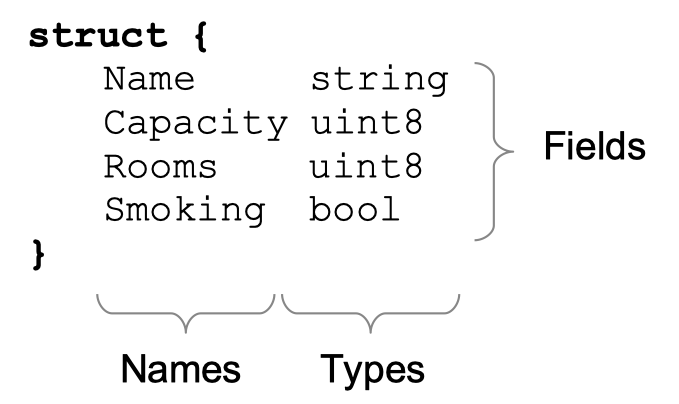
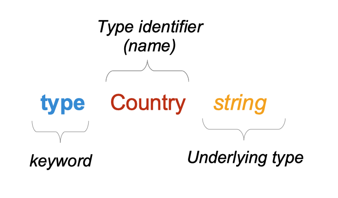
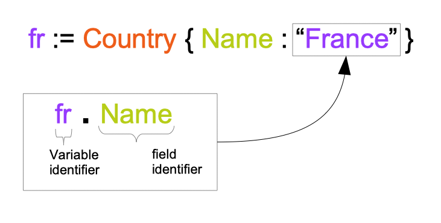
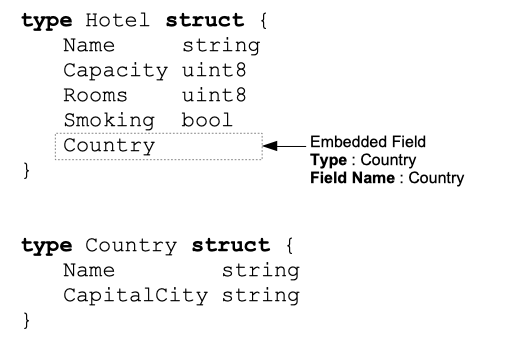

# 第13章: 类型


## 1 在本章你将学到什么？

- 什么是类型？

- 什么是类型推断？

- 什么是复合类型？

- 什么是字面值类型？

- 什么是结构体类型？

- 什么是内嵌字段？

- 如何创建类型？

## 2 涵盖的技术概念

- 类型

- 设置值

- 预先声明类型

- 结构体类型

- 复合类型

- 字段

- 内嵌字段

## 3 类型是什么？

“类型决定了一组值以及特定于这些值的操作和方法”。 让我们分解这个定义: 
 
- 一组值...

	- 类型为 `uint32` 的变量可以包含从0到4294967295的所有值。 这400多万个值是这种类型允许的值的集合。 
	
	- 字符串 "Go is Great" 不是一个 `uint32` 类型，该值不属于该类型允许的值的集合。  
 
- ...特定于这些值的操作和方法。 操作和方法是随类型值一起提供的功能。  
 
	- 类型有一组可以应用于这些类型值的操作和方法。  
 
	- Go 有预先声明的类型，但是您也可以创建自己的类型。 我们称这些类型为自定义类型。  
 
	- 可以定义附加到类型的方法。  
 
	- 例如，Booking 类型可以有一个方法来计算客户需要支付的总价。  
 
	- **注意**：我们将用专门的章节介绍它们 

## 4 类型推断

Go 有几个推断类型。 这些类型是 Go 核心的一部分；使用它们不需要声明它们。我们可以把它们分为三类:  

- Boolean type

	- bool

- String type

	- string


- numeric types

	- uint, uint8, uint32, uint64

	- int, int8, int32, int64

	- float, float32, float64

	- complex64, complex128

```go
var rooms uint8 = 130
var hotelName string = "New Golang Hotel"
var vacancies bool
```

## 5 复合类型

在前一节中，我们已经看到可以创建基本类型的变量。  
 
可以使用这些基本类型来构造复合类型。 
 
- 数组

- 指针

- 函数

- 切片

- 映射 通道

- 结构体

- 接口

```go
// types/composite/main.go
package main

import "fmt"

func main() {
    // 用基本类型 uint8 构造数组
    var arr [3]uint8

    // 用基本类型 uint8 构造指针
    var myPointer *uint8

    // 用基本类型 string 构造函数
    var nameDisplayer func(name, firstname string) string

    // 用基本类型 uint8 构造切片
    var roomNumbers []uint8

    // 用基本类型 uint8 和 string 构造maps
    var score map[string]uint8

    // 用基本类型 bool 构造通道
    var received chan<- bool

    // 结构体, 接口
    // ... 看下一节
    fmt.Println(arr, myPointer, nameDisplayer, roomNumbers, score, received)
}
```

```[3]uint8, *uint8, func(name, firstname string) string,...```被称作**字面量类型**。 复合类型就是用字面量构造的。

### 5.1

结构体类型是一种复合类型

```go
struct {
    Name     string
    Capacity uint8
    Rooms    uint8
    Smoking  bool
}
```

结构体字段分解[fig:Struct-fields-decomposition]:  

结构体由**字段**组成。字段可以:  
 
1. **显式**指定:在这种情况下，字段有一个名称和类型(在前面的例子中，所有字段都是显式的)

2. **隐式**指定:在本例中，我们将这些字段称为**内嵌字段**(参见下一节) 

## 6 怎样创建新类型：类型定义	

### 6.1	基于预先声明类型的新类型

我们可以基于现有的预先声明的类型声明新类型。

```go
// 新类型	 Firstname
// 基本类型 : string
type Firstname string

// 新类型	 Currency
// 基本类型 : string
type Currency string

// 新类型	 VATRate
// 基本类型 ：float64
type VATRate float64
```
 这里我们从另一个类型创建了一个新类型。另一种类型称为**基本类型**。

	type Country string

- 我们创建一个新类型 `Country`

	- 类型名称为 `Country`(标识)

	- `Country`的基本类型是字符串。
 

Type definition

### 6.2 基于复合类型的新类型

还可以使用基础复合类型声明新类型。

```go
// 新类型 "ExchangeRate"
// 基本类型是 map[string]float64
// map[string]float64 是字面量类型
type ExchangeRate map[string]float64


// 新类型 "Birthdate"
// 基本类型 : time.Time (Time 类型来自于 time 包)
type Birthdate time.Time


// 新类型 "Hotel"
// 基本类型 : struct
type Hotel struct {
    Name     string
    Capacity uint8
    Rooms    uint8
    Smoking  bool
}

// 新类型 "Country"
// 基本类型 : struct
type Country struct {
    Name        string
    CapitalCity string
}
```

## 7 结构体类型的创建

### 7.1 用字段名创建

```go
france := Country{
    Name:        "France",
    CapitalCity: "Paris",
}

usa := Country{
    Name: "United Sates of America",
}
```

我们创建了该类型的两个变量 `Country` : `france` 和 `usa`.

我们可以创建一个`Country`类型的新变量，而不需要指定任何字段的值:
```go
empty := Country{}`
```

也可以指定某些字段：
```go
usa := Country{
    Name: "United Sates of America",
}
```
其他字段将等于该字段类型的0值。这里CapitalCity的值将等于字符串的零值：`""`.

### 7.2 没有字段名称

```go
belgium := Country{
    "Belgium",
    "Bruxelles",
}
```
这里我们创建了一个`Country`类型的值，并将字段`Name`设置为“Belgium”，将字段`CapitalCity`设置为“Bruxelles”。
这个语法必须小心使用。
#### 7.2.1 字段值需要按照与类型结构声明相同的顺序指定
```go
type Country struct {
    Name        string
    CapitalCity string
}
japan := Country{
    "Tokyo",
    "Japan",
}
```
这段代码可以编译，但有一个错误。国家的名字将是 "Tokyo" (而不是 "Japan")
#### 7.2.2 不能跳过字段
```go
// WILL NOT COMPILE
china := Country{
    "China",
}
```
使用此语法时，应该初始化所有字段。
#### 7.2.3 不要把这两种语法混在一起!
```go
// WILL NOT COMPILE
greece := Country{
    Name: "Greece",
    "Athens",
}
```

## 8 如何访问字段:选择器表达式

怎样访问一个字段的值

通过`.`访问一个字段的值
```go
usa := Country{
    Name: "United Sates of America",
}
usa.CapitalCity = "Washington DC"
```
当然，也可以访问指定字段的值：
```go
if usa.Name == "France" {
  fmt.Println("we have an error !")
}
```
## 9 内嵌字段

在结构体类型中，我们可以添加内**内嵌字段**。内嵌字段是**隐式**定义的。

```go
type Hotel struct {
    Name     string
    Capacity uint8
    Rooms    uint8
    Smoking  bool
    Country
}

type Country struct {
    Name        string
    CapitalCity string
}
```
在结构体类型 `Hotel` 中，我们有一个内嵌字段 `Country`。`Country`是另一种类型结构。

内嵌字段没有显式名称。字段名是类型名。


内嵌字段

### 9.1 指针类型

在前一节中，我们已经看到可以将类型内嵌到结构体类型中。也可以将指针类型内嵌到类型结构中:

```go
type Hotel struct {
    Name string
    *Country
}

type Country struct {
    Name        string
    CapitalCity string
}
```
这里我们内嵌类型 `*Country` (指向类型 `Country` 的指针)。字段名是类型名 : `Country` :
```go
hotel := Hotel{
    Name:    "Hotel super luxe",
    Country: &Country{Name: "France"},
}
fmt.Println(hotel.Country.Name)
```

这个字段名也是`Country`.

##10 内嵌字段的使用

内嵌字段名将是它的类型。让我们先来看个例子：
```go
// types/embedded/main.go
package main

import "fmt"

type Hotel struct {
    Name string
    Country
}

type Country struct {
    Name        string
    CapitalCity string
}

func main() {
    hotel := Hotel{
        Name:    "Hotel super luxe",
        Country: Country{Name: "France"},
    }
    fmt.Println(hotel.Country.Name)
}
```

这里结构体类型`Hotel`有两个字段：

	- 一个是显式字段：`Name`(string 类型)
	
	- 另一个是隐式内嵌字段：`Country`
	
内嵌字段的名字就是它的类型名称

## 11 自测题
### 11.1 问题
1. 给出一个数组类型字面值的例子。

2. 基本类型和复合类型之间有什么区别？

3. 在程序中，你会发现如下代码：`type Switch bool`, 这个类型的名字是什么？它的基本类型是什么？

4. `uint8`是复合类型。这个说法正确吗？

5. 类型T内嵌字段的名字是什么？*T的呢？ 
### 11.2 答案
1. 给出一个数组类型字面值的例子。

	1. `[123]uint64`

2. 基本类型和复合类型之间有什么区别？

	1. 在Go语言中，基本类型是预先声明类型。在使用时没有必要提前声明。
	
	2. 复合类型不是预先声明类型，可以使用字面量类型声明。

3. 在程序中，你会发现如下代码：`type Switch bool`,这个类型的名字是什么？它的基本类型是什么？
	
	1. 类型名称是 `Switch`
	
	2. 基本类型是 `bool`   

4. `uint8`是复合类型。这个说法正确吗？
	
	1. 错误。`uint8` 是预先声明的简单类型。
	
	2. 不是复合类型是因为它不是由其他类型组成。`map[uint8]string` 是复合类型。
	
5. 类型T内嵌字段的名字是什么？*T的呢？
	
	1. T

## 12 要点归纳

- 类型是具有特定于这些值的操作和方法的一组值
 
	- 我们将专门用一章节来介绍操作和方法
	 

- 可以用 Go 预先声明的基本类型创建复合类型
- 
- 复合类型是用类型字面量类型构造的
- 
- 复合类型包含:

	- 数组、结构体、指针、函数、接口、切片、映射和通道类型


- 结构体类型允许把数据与字段组合在一起。结构体的每个字段都有一个类型和一个名称(标识符)

- 我们可以**显式**或**隐式**地指定结构体的字段。

- 隐式地:可以将内嵌类型放到结构类型中，该字段被称为“内嵌字段”

```go
type Country struct {
    Name        string
    CapitalCity string
}

type Hotel struct {
    Name     string
    Country
}
```

`Name` 是一个**显式**指定的字段

`Country` 是一个结构体类型，它同时也是 `Hotel` 结构体的一个字段，是一个**内嵌字段**

- 从结构体中选择一个值， 可以用选择器，字符为 `.`。

```go
hotel := Hotel{
    Name:    "Gopher team hotel",
    Country: Country{
        Name: "France",
        CapitalCity: "Paris",
    },
}

log.Println(hotel.Name)
log.Println(hotel.Country.CapitalCity)
```